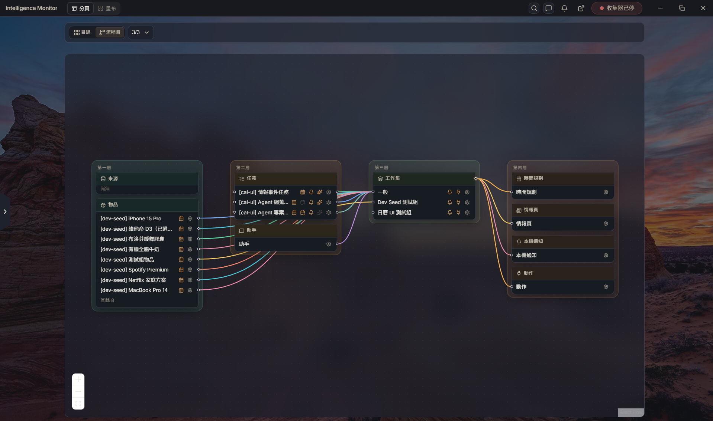
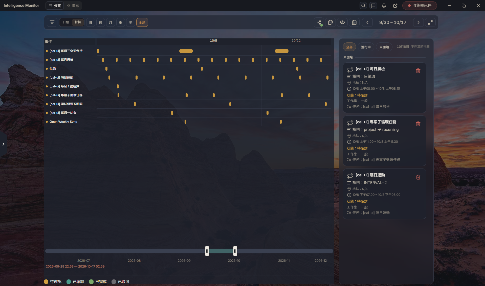

#  Intelligence Monitor

自託管的多源情報監控與 AI 分析桌面工作站：採集 → 排程分析 → 時間規劃／畫布 → 通知與動作，全在本機完成。



契約細節見 [`docs/ARCHITECTURE.md`](docs/ARCHITECTURE.md)。文件索引：[`docs/README.md`](docs/README.md)。

## 功能

- **採集** — Telegram、Discord、RSS、MQTT、Email (IMAP)；統一入庫、SSE 即時更新
- **分析** — `leaderboard`／`intel_event`／`agent`；Ollama / OpenAI / Gemini / OpenRouter
- **時間規劃** — 日曆／甘特。甘特離散尺標 **日／週／月／季／年**；**全局**（Overview）為連續平移／縮放視窗，底欄為地圖式時間軸。日曆另有 **塊**（按來源分月卡）

  

  
- **物品／工作集** — 庫存與歸屬標籤；不是主導航重做
- **助手／通知／畫布** — 自然語言助手、本機通知、可排版儀表
- **日曆分享** — 可選；公開日曆來源預設 **https://subscribe.devents.tech**。自架 IntelligenceCalendar sidecar（不在本倉庫）仍用本機 `http://127.0.0.1:8787`。IM 只經 `/api/v1/calendar-share/*` 代理，前端不直連
- **本地優先** — SQLite **schema stamp 7**（`SCHEMA_FLOOR`＝current；生產 `SCHEMA_MIGRATIONS` 為空）

任務是通用接口（`analysis_tasks`）；**週期任務**走獨立 `recurring_schedules`，**RRULE 僅於查詢時展開**、**不會觸發 AI 分析**。AI 排程支援 10 秒、每小時、每日、每週、自訂秒數。見 [Core design](docs/ARCHITECTURE.md#core-design-task-as-universal-interface)。

## 需求

- **Python** ≥ 3.11（[uv](https://docs.astral.sh/uv/)）
- **Node.js** ≥ 20.19.0（見 `.nvmrc`；Vite 6.4.3）
- **Ollama** 可選（本機 LLM）

Windows：若 `C:\Windows\System32\` 有 **0-byte** 的 `node`／`npm` stub，會蓋住真 Node。刪掉空檔（需管理員）或把真實 Node 目錄放到 PATH 最前。`npm run dev` 會警告，不會代刪。

## 開發

```bash
uv sync --extra dev --locked
npm ci
npm run dev          # Server + Vite HMR + Electron
```

| 指令 | 說明 |
|------|------|
| `npm run dev:web` | Server + Vite（不開 Electron） |
| `npm run dev:server` | 僅 Python server（`18820`） |

**Schema 不符／升級後無法啟動？** 空庫直接建當前 DDL。**stamp 1–6** 硬拒絕：先備份再 reset。**未來 stamp** 請先升級應用。停掉 dev／Electron／獨立 server 後：

```bash
uv run python scripts/reset_local_databases.py          # dry-run
uv run python scripts/reset_local_databases.py --apply
```

腳本只刪已知 SQLite（含 `-wal`／`-shm`），不動 Telegram sessions、`secret.key`、`connection.json`。詳見 [`docs/SCHEMA-BASELINE.md`](docs/SCHEMA-BASELINE.md)。

可選示範種子與 live_eval 在 [`scripts/dev/`](scripts/dev/)，產品運行不需要。

## 指令

| 場景 | 指令 |
|------|------|
| 本機關卡 | `npm run check`（lint → i18n／OpenAPI 漂移 → 型別 → 全部測試）；`check:fast`＝lint + typecheck |
| 測試 | `npm test`／`test:server`／`test:web`／`test:desktop`／`test:all` |
| 建置 | `npm run build`（Web + Desktop） |
| 打包 | `dist:win`／`dist:mac`／`dist:linux`／`dist:current` |
| 容器 | `npm run docker:build`；`docker compose up --build` |
| 發佈後檢查 | `npm run verify:deploy`（已註冊庫需 `VERIFY_BEARER`／`IM_ACCESS_TOKEN`） |

**CLI** 用源碼：`uv sync --locked` 後 `uv run python -m server`（或 `uv run intelligence-monitor`）。GitHub Release **不附** CLI zip。

**CI：** PR 只跑 quality。`git push` 到 `main` → Release（quality → 寫回 `VERSION` 並 commit → tag → 一次 Vite → 三平台 Desktop + GHCR）。產品 SemVer＝git tags；schema stamp **不必**等於產品 tag。

## Schema

| | |
|--|--|
| Stamp | **7**（`SCHEMA_FLOOR`＝current；`SCHEMA_SEMVER` `1.6.0`） |
| 遷移 | 生產 `SCHEMA_MIGRATIONS` **為空**（無 5→6 原地升級） |
| 舊庫 | stamp 1–6 hard-reject → 備份後 reset |
| 未來 | 升級應用；壞庫／fingerprint 不符才 reset。**絕不**靜默刪庫 |

SoT：[`docs/SCHEMA-BASELINE.md`](docs/SCHEMA-BASELINE.md)。

## 設定

執行期設定在 SQLite `system_config`。LLM／保留策略走 **Settings**；API 金鑰在 **帳戶 → API 金鑰**。

訂閱／發佈的公開日曆分享來源是 **https://subscribe.devents.tech**（訂閱頁「服務網址」預設；含 `https`、無尾斜線）。本機自架 sidecar 請改填 `http://127.0.0.1:8787`。

| 變數 | 用途 |
|------|------|
| `INTELLIGENCE_MONITOR_DATA_DIR` | 資料根（DB／`secret.key`／`sessions/`／`connection.json`） |
| `INTELLIGENCE_MONITOR_DB` | SQLite 路徑覆寫 |
| `INTELLIGENCE_MONITOR_HOST` | 綁定 host（預設 `0.0.0.0`） |
| `INTELLIGENCE_MONITOR_SECRET_KEY_FILE` | 加密金鑰（Desktop 自動設） |
| `IM_FRONTEND_DIST` | 建置後前端（Desktop 自動設） |

授權：裝置 session（UI／SSE）與長效 API 金鑰（Webhook／A2A）並存。細節與手動清單：[`docs/AUTH.md`](docs/AUTH.md)。

## Desktop

`userData/connection.json`：`host`（預設，起本機 sidecar）或 `client`（連遠端 `serverUrl`）。

| 連接埠 | 用途 |
|--------|------|
| **18820** | Python REST + SSE + 靜態檔 |
| **1420** | Vite 開發代理 |

## 文件

| 文件 | 內容 |
|------|------|
| [`docs/ARCHITECTURE.md`](docs/ARCHITECTURE.md) | 架構；Timeline 日曆／甘特／**全局**；calendar-share sidecar |
| [`docs/SCHEMA-BASELINE.md`](docs/SCHEMA-BASELINE.md) | Stamp 7／空遷移／reset |
| [`docs/I18N-GLOSSARY.md`](docs/I18N-GLOSSARY.md) | 用語（含 **全局** / Overview、**塊** / Block） |
| [`docs/KNOWN-SIMPLIFICATIONS.md`](docs/KNOWN-SIMPLIFICATIONS.md) | 有意差異 |
| [`docs/AUTH.md`](docs/AUTH.md) | 登入／金鑰 |
| [`docs/agent/`](docs/agent/) | 助手／A2A／MCP／Agent tick |

## 授權

**MIT** — [`LICENSE`](LICENSE)。安全政策 [`SECURITY.md`](SECURITY.md)；貢獻 [`CONTRIBUTING.md`](CONTRIBUTING.md)。
