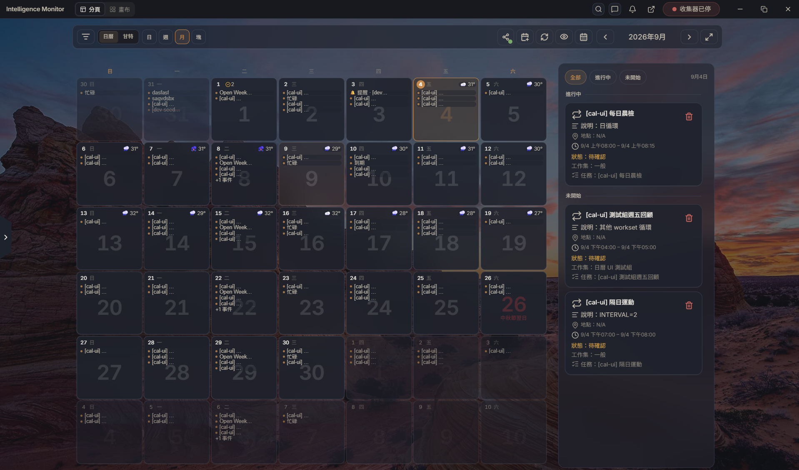
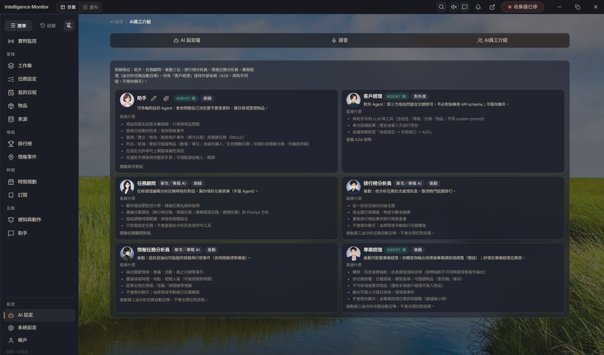
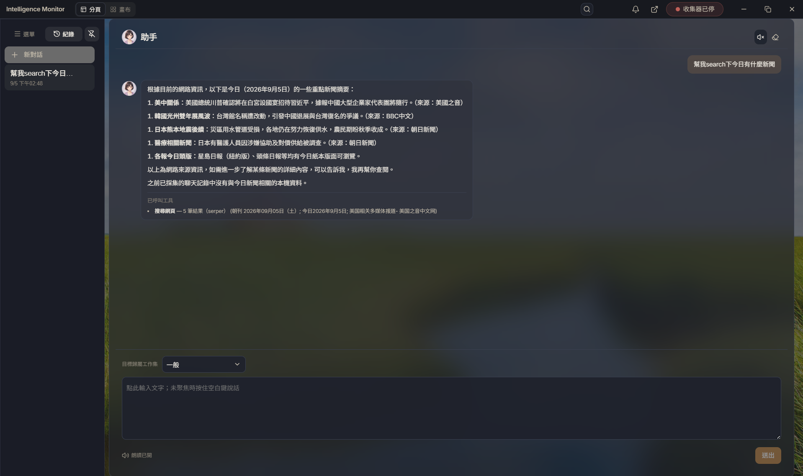
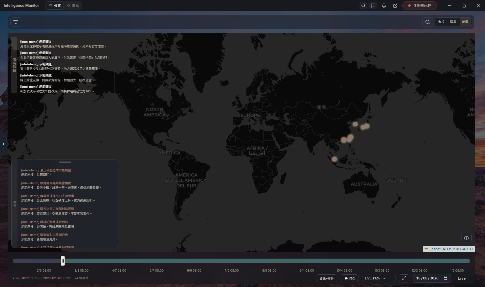
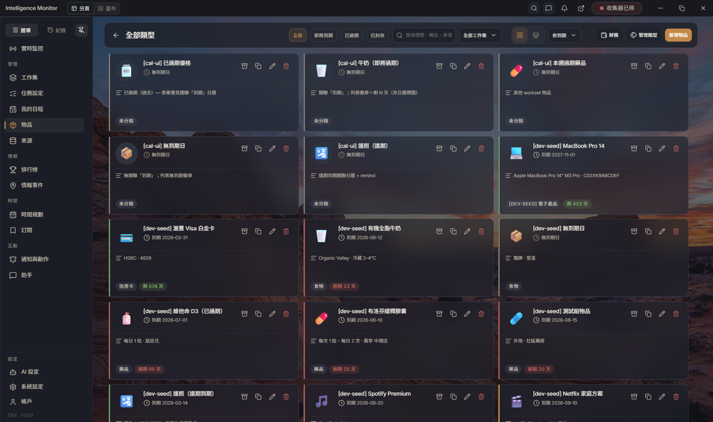
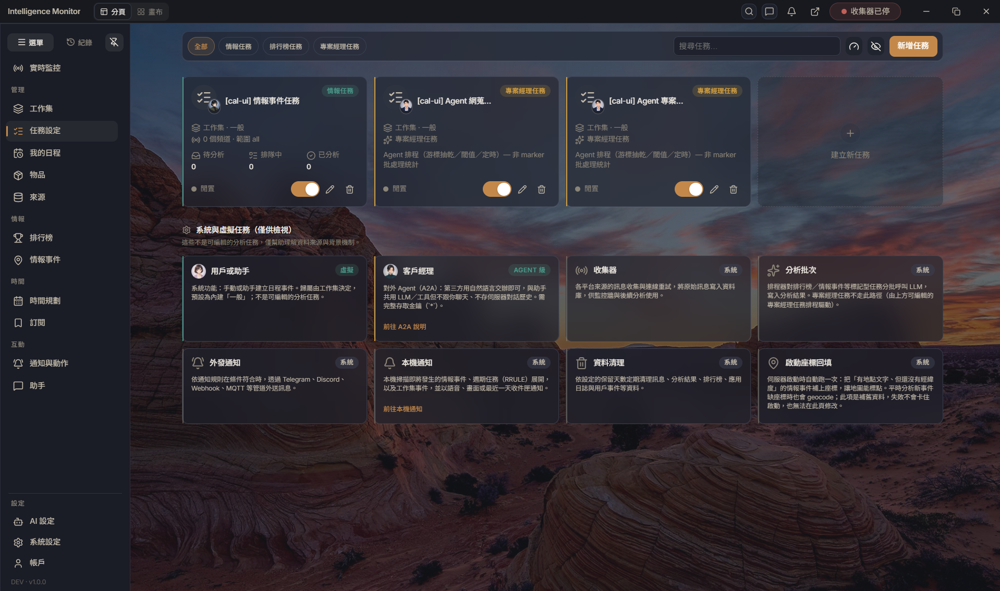

[繁體中文](README.md) | [简体中文](README.zh-Hans.md) | [English](README.en.md)

#  Intelligence Monitor

本机优先的家庭情报工作站：把 Telegram、Discord、RSS、MQTT、Email 等来源收进来，用 AI 整理成情报与事件，再落到日历、任务、物品与地图。助手可随时查问或代为改行程。

## 画面



月历与当日行程。



助手、客户经理与后勤分析角色。



与助手对话、查情报或改日程。



情报事件落在地图上。



物品库存与到期。



分析任务与监控设置。

## 实际使用

1. **下载或本机跑** — 从 [GitHub Releases](https://github.com/Wing9897/im/releases) 安装 Desktop（Windows／macOS／Linux）。开发则：

   ```bash
   uv sync --extra dev --locked
   npm ci
   npm run dev
   ```

2. **首次启动** — 建立家庭管理员账号。Desktop 可选本机服务，或连到已有的远程服务器。
3. **登录** — 之后用同一组账号进入。
4. **建立工作集** — 侧栏「工作集」→ 新建，用来归属情报、日程与物品（也可先用内建「一般」）。
5. **加来源／情报** — 「来源」接 Telegram、Discord、RSS、MQTT、Email 等；情报页看事件与排行。
6. **日历与任务** — 「时间规划」看月历／甘特；「任务设定」设要监控与分析的排程。**周期任务**走独立排程，**RRULE 仅于查询时展开**、**不会触发 AI 分析**。AI 排程支援 10 秒、每小时、每日、每周、自定义秒数。
7. **助手** — `Ctrl+J`（macOS `⌘+J`）随时叫出，或开助手页。需先在设置接好 AI 供应商。
8. **设置** — 语言、AI、通知、外部接口都在设置。账户页可发访问密钥。

升级后若旧库无法启动：当前是 **schema stamp 7**（`SCHEMA_FLOOR`＝current；生产 `SCHEMA_MIGRATIONS` 为空）。stamp 1–6 **hard-reject**，须备份后 reset。**未来 stamp** 请先**升级应用**。停掉 Desktop／`npm run dev` 后：

```bash
uv run python scripts/reset_local_databases.py --apply
```

## 外部 Agent／MCP

任何支持 Streamable HTTP 的外部 Agent 都可连 `{API origin}/api/v1/mcp`（结构化工具，不是聊天）。到账户建立 scope `*` 密钥，再到 **设置 → 外部接口 → MCP** 开总开关与能力组。OpenClaw 只是其中一种客户端。契约：[`docs/agent/mcp.md`](docs/agent/mcp.md)。

要用一句话交办、由本机选工具，走 A2A（`POST /api/v1/a2a/agent`）：[`docs/agent/a2a.md`](docs/agent/a2a.md)。

## 日历分享（可选）

公开 hub：**https://subscribe.devents.tech**。本应用只经 `/api/v1/calendar-share/*` 代理，前端不直连。

## 开发者

```bash
uv sync --extra dev --locked
npm ci
npm run dev
npm run check
```

Python ≥ 3.11、Node.js ≥ 20.19.0。Windows 若 `C:\Windows\System32\` 有 0-byte 的 `node`／`npm` stub，会盖住真 Node。PR 前跑 `npm run check`（与 CI Ubuntu quality 相同）。`zh-Hant` 为界面文案来源。安全问题走 [`SECURITY.md`](SECURITY.md)，不要开公开 issue。

其余契约：[`docs/README.md`](docs/README.md)。授权 MIT（[`LICENSE`](LICENSE)）。
