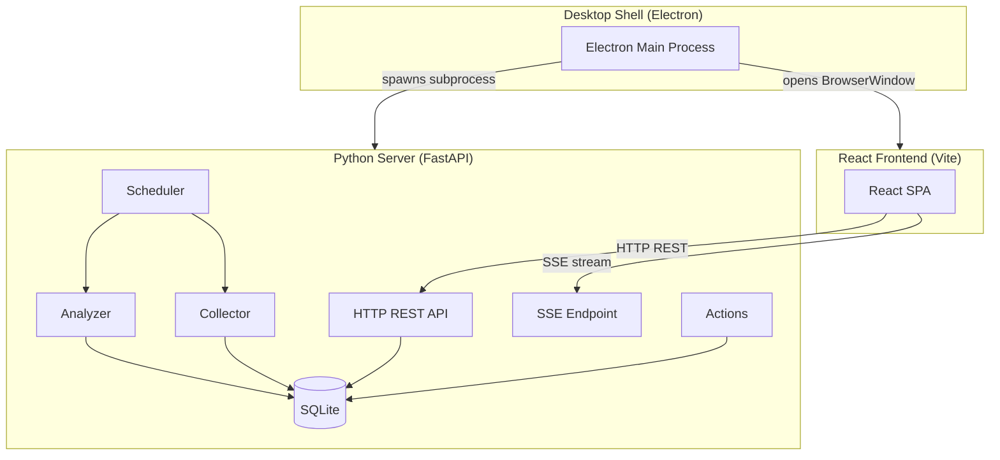
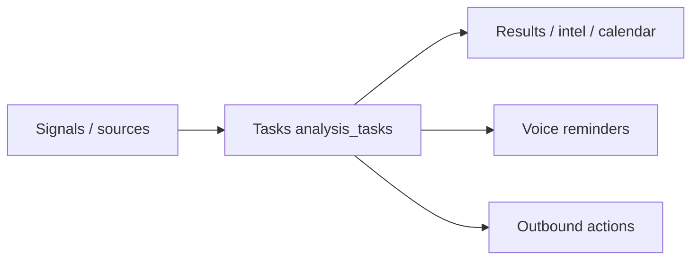
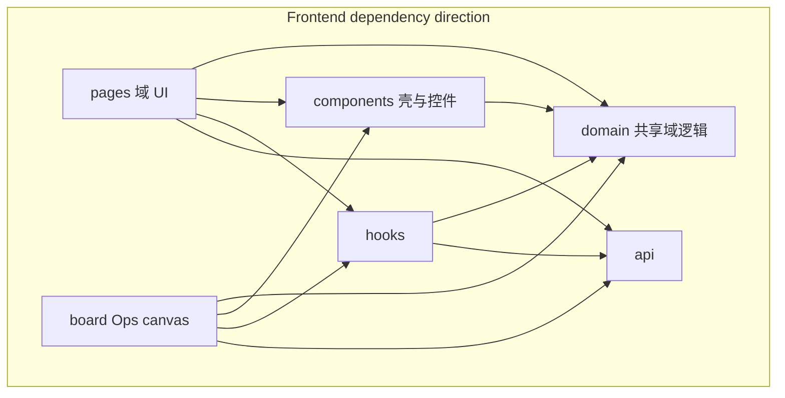

# Architecture

Intelligence Monitor is a three-component desktop application for monitoring, collecting, and analyzing messages from multiple platforms (Telegram, Discord, RSS, MQTT, Email/IMAP) using LLM-powered analysis.

## System Overview



## Core design: Task as universal interface

**Analysis tasks (`analysis_tasks`) are the universal product interface.** Multi-source signals are selected via `task_channels` → configured as a task (mode / prompt / RRULE / schedule) → consumed as results, reminders, and actions. Downstream UIs (intelligence, timeline, board widgets, actions, voice reminders) scope work via hierarchical source filters `{ taskIds, worksetIds }` (or a task whitelist) — ownership of handwritten／assistant calendar items is by `worksetId`, not a lone `taskId` / `taskId=__user__` sentinel.



| Task field role | Meaning |
|-----------------|---------|
| `mode` | **Open-loop:** `leaderboard` / `event`（單次 LLM JSON → 結果表）. **No LLM:** `recurring`（循環任務 / RRULE）. **Closed-loop:** `project`（專案管理 — 多輪 Agent + 工具改日程） |
| `task_channels` | Which collected channels feed the task (AI modes including `project`) |
| `version` | Invalidation boundary for batches / markers / findings |
| Schedule / RRULE | Interval/cron for AI modes (`project` defaults hourly); iCal RRULE for recurring (query-time expand only) |
| `parent_task_id` | Optional FK on `recurring_schedules` for child `recurring` rows owned by a `project` task (`ON DELETE CASCADE`) |

**Naming对照（docs only, no wire rename）**

| Concept | Wire / id | Not the same as |
|---------|-----------|-----------------|
| Task mode without LLM | `analysisMode: "recurring"` (RRULE) | Timeline UI `viewMode: "calendar"` (calendar vs gantt layout) |
| Board calendar widget | widget type `"calendar"` | Any task analysis mode |

Timeline `viewMode:"calendar"` and board widget `"calendar"` are layout ids, not analysis modes.

**In → Task → Out**

1. **In:** Collectors write `messages` for accounts/channels (signal plane).
2. **Task:** Scheduler runs AI for `leaderboard` / `event` via `execute_batch`, and `project` via `project_tick` (`AgentRuntime`); `recurring` RRULEs expand only at read time.
3. **Out:** `analysis_events` / leaderboard topics, board widgets, actions, and voice reminders bind to task ids; `user_events` ownership is `workset_id` (NOT NULL, default `__user__`) with optional provenance `task_id`; `project` writes owned `user_events` + child `recurring` only (no analysis_events).

**Task-scoped UI vs exceptions**

| Surface | Scoped by |
|---------|-----------|
| Intelligence, Timeline (analysis), Leaderboard, board widgets, actions | Hierarchical `{ taskIds, worksetIds }` / task whitelist (`event` / `recurring` / `project`); builtin workset `__user__` for「一般」 |
| Voice reminder filter | ui-prefs `sourceFilter: { taskIds, worksetIds } \| null` (not a lone `taskId` / `__user__` sentinel) |
| Monitor / Sources | Signal plane (accounts/channels), not analysis tasks |
| Manual / assistant / A2A calendar items | `user_events`: ownership via `workset_id` (builtin `__user__`); optional `task_id` provenance only |
| Shell prefs (board layout, assistant sessions, voice reminder state, voice IO defaults) | SQLite via `/api/v1/ui-prefs/*` — not task rows |

## Components

### Python Server (`server/`)

The single backend process handling all business logic. Built with **FastAPI** running on **uvicorn**, listening on port **18820**.

| Module | Responsibility |
|--------|---------------|
| `api/` | HTTP route handlers (count from `scripts/project_stats.py` via `npm run stats`; health, accounts, channels, messages, tasks, results, config, system, actions, logs, viewer, agent, weather, **calendar** (`items`／`imports`／`dismissals`／`user-events`), worksets, setup, task_assistant, events SSE) |
| `wire/serializers.py` | Neutral snake_case → camelCase wire builders matching the frontend contract (tasks, analysis events, user events, queue, …); shared by HTTP and non-HTTP callers |
| `api/routes/weather.py` | Open-Meteo／fallback weather proxy (`GET /api/v1/weather/*`) — avoids renderer CORS |
| `api/routes/task_preset_data.py` | Builtin **task template catalog** (`BUILTIN_PRESETS`) — generated from [`shared/task_presets.json`](../shared/task_presets.json) via `scripts/sync_task_presets.py` (see [`docs/I18N-GLOSSARY.md`](I18N-GLOSSARY.md#任務模板-presets顯示文案-sot)) |
| `queries/` | Shared SQL helpers (`accounts_queries`, `actions_queries`, `results_queries`, `tasks_queries`, `viewer_queries`, `messages_queries`, `version_sql`, …) |
| `analysis_control.py` | Unified pause / resume / abort for analysis batches |
| `db/` | SQLite persistence via aiosqlite — current baseline **v5** DDL in `db/schema_ddl.py` (fingerprint derived from the DDL in `db/schema_fingerprint.py`; thin re-export in `db/schema.py`), wipe-only bootstrap／reject in `db/migrations.py`（no migration registry; non-current stamps hard-reject → reset）, public SemVer `SCHEMA_SEMVER`／connection/reset wrapper in `db/database.py` |
| `db/schema_inspect.py` | Schema fingerprint inspect + mismatch categories (re-exported from `migrations` for callers/tests) |
| `household_auth.py` | Lightweight household auth: admin password → device session; revocable API keys (`*` / `read`) |
| `scheduler/` | APScheduler-based periodic analysis scheduling, batch execution, result persistence, multi-category data retention (`server/scheduler/retention.py`) |
| `collector/` | Platform adapters — Telegram, Discord, RSS, MQTT, Email (IMAP poll + UID cursors; fetch/parse helpers in `email_imap_fetch.py`) — with automatic reconnect/backoff |
| `collector/adapter_factory.py` | **Input registry:** `ADAPTER_BUILDERS` keyed by `domain/collector_platforms.COLLECTOR_PLATFORMS` → `build_adapter` |
| `domain/collector_platforms.py` | Leaf platform vocabulary (DDL + factory + FE mirror) |
| `domain/analysis_modes.py` | **Process registry:** `AnalysisModeSpec` / derived frozensets (DDL + FE mirror) |
| `collector/manager.py` | Public collector façade — account lifecycle, shared adapter registry, aggregate SSE status, and platform delegate entry points |
| `collector/manager_retry.py` | Internal `CollectorRetryOrchestrator` — owns auto-connect, SQLite-busy retry, deferred retry handles, and shutdown drain |
| `collector/manager_sources.py` | Per-platform collector connect/disconnect delegates (Discord / RSS / MQTT / Email); Telegram login/session flows live in `telegram_login.py` |
| `collector/capabilities.py` | Shared adapter capability wiring and platform feature flags |
| `collector/telegram_session.py` | Telegram auth persisted as Telethon `StringSession` in `{DATA_DIR}/sessions/{account_id}.session.txt` |
| `paths.py` | Unified Desktop／CLI data root (`INTELLIGENCE_MONITOR_DATA_DIR` or product userData); full reset clears sessions, secret.key, and connection.json |
| `collector/http_poll_helpers.py` | Shared helpers for HTTP poll adapter |
| `collector/email_imap_fetch.py` | IMAP fetch / UID cursor helpers (public entry remains `email_imap.py`) |
| `analyzer/` | AnalysisEngine + configurable LLM client (Ollama, OpenAI, Gemini, OpenRouter), incremental markers, analysis modes (`leaderboard` / `event` oneshot LLM; `project` closed-loop Agent ticks in `scheduler/project_tick.py`; `recurring` skips AI); prompt **assembly** in `analyzer/prompt.py` |
| `prompts/` | **System / schema prompt** string library (`analysis` / `assistant` / `clock` / …) + `locale.py` (UI locale normalize + output-language directive). Find wording here; assembly lives in `analyzer/prompt.py` / `agent/runtime.py`. This is **not** the user-facing task template catalog — that lives in `api/routes/task_preset_data.py` (see below) and has zh-Hant UI locale as its display-text source of truth ([`docs/I18N-GLOSSARY.md`](I18N-GLOSSARY.md#任務模板-presets顯示文案-sot)) |
| `prompts/clock.py` | `current_time_prompt_block` — injects wall-clock context into analysis / agent prompts (deep-import by design; not re-exported from `prompts/__init__.py`) |
| `agent/` | Text Agent runtime + tool registry (`calendar.*` / `messages.search` / optional `web.search`; `POST /api/v1/agent/chat`); see [Agent / assistant](#agent--assistant) |
| `agent/project_scope.py` | Project-tick tool argument scoping (`project_scope_task_id`); calendar event writes use `origin=project` via `PROJECT_CHANNEL` |
| `agent/tool_args.py` | Coercion for LLM-supplied tool arguments (int / bool / optional / camelCase-or-snake_case key aliases) — the one implementation every `tools_*` module uses |
| `web_search/` | Multi-provider web search clients (DuckDuckGo default, Brave optional) for Agent tools |
| `queries/messages_queries.py` | Shared message list filters + cursor page (REST + Agent) |
| `calendar/` | Shared calendar package: `query` (read／merge), `rrule` (validate／expand), `normalize` (wire-shape builder), `ics` (RFC 5545 parse／normalize), and `imports` (preview／atomic UID upsert). HTTP under `api/routes/calendar/` (`items`／`imports`／`dismissals`／`user-events`). **Manual write／dismiss service modules stay at top level:** `user_events.py` + `timeline_dismissals.py`. |
| `services/task_writes.py` | Task-write rules shared by `POST/PUT /api/v1/tasks` and the calendar agent tools: RRULE validation + canonical storage (no `RRULE:` prefix), recurring-only recurrence gate, `HH:MM` clock normalize |
| `time_iso.py` | UTC ISO-8601 helpers (`Z` form) for parsing/formatting timestamps |
| `user_events.py` | Shared CRUD for manual UI + assistant calendar tools (wire shape via `wire/serializers.serialize_user_event`) |
| `actions/` | Automated responses — Telegram send, Discord send, HTTP webhook, MQTT publish |
| `outbound.py` | Outbound notify dispatch helpers used by actions |
| `ingestion.py` | Shared message ingestion (channel upsert + dedup insert) |
| `auth.py` | Bearer auth: API key **or** device access token; localhost bypass; remote write gate |
| `device_auth.py` | Device sessions, opaque token hashing |
| `admin_auth.py` | Singleton admin account (argon2 hash / verify) |
| `sse.py` | SSE event broadcaster (`/api/v1/events`; route module in `api/routes/events.py`); `publish_resource_modified` is the only place the `resource_modified` payload is built (REST routes via `api/deps.py`, agent writes via `agent/tools_registry.py`) |
| `errors.py` | Global exception handlers producing structured error responses |
| `config.py` | `system_config` key-value access with defaults and clamping |
| `main.py` | FastAPI app factory and lifespan owner of startup geocode backfill; drains the task before dependent resources close; uvicorn entry point (`python -m server`) |

### Managed-task lifecycle ownership

| Owner | Managed work | Shutdown boundary |
|-------|--------------|-------------------|
| FastAPI lifespan (`server/main.py`) | Startup geocode backfill handle | Cancels/awaits backfill before scheduler, collector, engine, executor, and database close |
| `SchedulerManager` (`server/scheduler/manager.py`) | Dispatch, retention, and in-flight batch tasks | Stops producers, allows bounded grace, then cancels/gathers batches before processing-row invalidation |
| `CollectorManager` façade (`server/collector/manager.py`) | Shared adapter registry, aggregate status, and disconnect coordination | Awaits its retry delegate before disconnecting adapters |
| `CollectorRetryOrchestrator` (`server/collector/manager_retry.py`) | Auto-connect and per-account deferred retry handles | Sets shutdown guard, snapshots, cancels/gathers, then identity-clears handles |

The collector manager delegates in `collector/manager_sources.py` and `collector/manager_retry.py` retain platform-specific entry points and retry orchestration; they do not own a second adapter registry.

### API error codes (i18n prep)

User-visible API failures should prefer a stable snake_case `error_code` in the structured body (`error_code` / `message` / `details` / `correlation_id`). Prefer `server.errors.http_error(...)` over bare Chinese `HTTPException(detail=...)`.

The web client (`web/src/utils/errors.ts` → `toErrorMessage`) looks up `messageForErrorCode` (`web/src/i18n/errorCodes.ts`) first, then falls back to `message`. See [`docs/I18N-GLOSSARY.md`](I18N-GLOSSARY.md) for the glossary and pilot codes (`weather_*`, `agent_timeout`).

The server integrates collector, analyzer, and action modules as direct in-process function calls — no inter-process communication layer.

### React Frontend (`web/`)

A **React** single-page application built with **Vite**. Communicates with the server exclusively via HTTP REST requests and an SSE event stream. The frontend handles UI rendering, state management, and user interaction.

- **Build**: Vite (development server with proxy, production static bundle)
- **Language**: TypeScript
- **Styling**: Theme palettes live in `web/src/styles/themeCatalog.ts` (SoT). `npm run gen:themes` emits `web/src/theme.generated.css`; `theme.css` keeps shared `:root` / layout tokens and `@import`s the generated file. Runtime switching uses `html[data-theme]` + `data-theme-mode` + `data-theme-family` (desk / classic / special) + `data-theme-texture` (thematic motifs: leaf / wood / wave / frost / ember / petal / mist / moss / washi / ink / dune / linen / grid / grain / none) + `data-theme-bg` (`none` | `custom`) via `applyTheme` — zero FOUC. When no custom photo BG, page + sidebar get the motif as a background layer; elevated cards / control bars / secondary buttons also use it selectively. Motif SVGs live in `web/src/css/theme-textures.css` (regen: `node scripts/generate-theme-textures.mjs`). Catalog mixes near-black / paper bases with non-matching accents (Sumi, Moss, Harbor, Ember, Clay, Orchard, Mist, Copper, …). Tailwind v4 (`@tailwindcss/vite`, utilities only / no Preflight) bridges semantic colors / surfaces / motion in `tailwind.css` `@theme`. New UI and touched pages use utilities + thin primitives under `web/src/components/ui/`. `pages/` inline spacing/radius/typography hardcodes are ratcheted at zero via `tokenCompliance`. Map overlay chrome, board map/gantt embed chrome use theme spacing/radius/type tokens; Leaflet vendor CSS and marker/cluster/gantt geometry stay untouched. Fourteen curated themes; legacy localStorage IDs remap in `themeCatalog.ts`.
- **Communication**: HTTP REST for commands/queries, SSE for real-time server-pushed events
- **Scrolling**: `body` / `#root` use `overflow: hidden`; page scroll happens on `.app-shell-main`. Infinite-scroll hooks and the monitor list virtualizer must use `getVerticalScrollParent` / `useScrollContainerState` (`web/src/utils/scrollParent.ts`) — not `window.scrollY`.
- **Notifications workspace** (`/actions`): UI label **通知**; tabs `types` / `voice` / `history` (外發通知 / 語音提醒 / 觸發紀錄). Backend automation APIs remain under `/api/v1/actions*` — UI name ≠ API resource name.
- **Naming:** `pages/actions/ActionTypeSelector.tsx` is the **ActionType** tile picker (Telegram Bot / Discord / HTTP / MQTT). Per-type field sections render via `ActionTypeFields`; form helpers use `validateActionTypeFields` / `applyActionTypeSwitch`. The default notifications tab component is `ActionTypesTab` — wire tab id is `"types"` (URL `?tab=` / i18n `tabs.types` / `types.*` keys). Real account↔channel picking lives under `components/channels/` (`AccountChannelPickerContent`, `ChannelPickerDialogShell`) and dialogs like `ChannelSelectorDialog` (not the retired dead `pages/actions/ChannelSelector`).
- **Voice reminders**: frontend-local scanner (`web/src/voiceReminder/`); route `/actions?tab=voice`. It page-loads timed key events + RRULE occurrences inside the reminder window and overlapping **user events**. Ownership matches timeline: filter via hierarchical `sourceFilter` (`{ taskIds, worksetIds } | null`) through the shared `SourceFilterDialog` tree; builtin `__user__` (`SYSTEM_WORKSET_ID`) workset covers「一般」events. Default is `{ taskIds: [], worksetIds: ["__user__"] }`; `null` = all sources. Flat legacy `taskIds` arrays are hard-rejected (missing → default). Browser TTS/scanning stays in the frontend; reminder settings/history/fired dedupe are SQLite-backed and unrelated to Agent STT/TTS on `/ai/voice`.
- **Assistant UI**: `/assistant` chats via Agent API; browser speech adapters under `web/src/speech/`; session lists persist as device-scoped JSON values in SQLite `ui_prefs` via `GET/PUT /api/v1/ui-prefs/assistant/sessions` (server SoT; no localStorage migrate). Chat (and pure-voice) may send `worksetId` so `calendar.create_event` defaults to that ownership workset; UI default comes from voice IO `defaultWorksetId` (default `__user__`). Recurring schedules use `calendar.create_recurring_task`／`update_recurring_task`／`delete_recurring_task` (recurring-mode only; delete is soft `isActive=false`).
- **AI settings pages** (`web/src/pages/ai/`): route-level UI for `/ai/*` — `SettingsAiProviderPage` (`/ai/provider`), `SettingsVoicePage` (`/ai/voice` — includes `defaultWorksetId` for assistant calendar writes), `SettingsAnalysisStrategyPage` (`/ai/analysis-strategy`), `SettingsAiStaffPage` (`/ai/staff`), plus `AiWorkspacePage` shell and `assistant/AssistantPage` (`/assistant`). Not under `pages/settings/`.
- **Account**: `/account/identity|devices|keys` (no `/profile` redirect shim).
- **UI prefs hard-cut:** voice IO / voice-reminder / timeline annotations hydrate from SQLite only — empty server → defaults／empty. Their retired localStorage migration/cleanup bridges are gone after the pre-wipe-floor / prior stamps. User profile likewise (server settings SoT; active LS cache only).
- **AI Staff** (intro page `/ai/staff`): presentation-only roster of the app's LLM "staff" (assistant, task editor, leaderboard, event intel, **project manager**) plus a page-local **客戶經理 / Account manager** card (code id `liaison` — A2A channel of the assistant, not a sixth `AiStaffId` / runtime) — `web/src/assets/ai-staff/` (avatars) + `web/src/domain/aiStaff/` (roster data) + `web/src/components/aiStaff/` (avatar/chat-row chrome). Page implementation lives at `web/src/pages/ai/SettingsAiStaffPage.tsx`. Not a backend concept; does not own prompts or task presets. Lightweight API how-to: `/settings/api`. A2A HTTP façade: [`docs/agent/a2a.md`](agent/a2a.md). Project closed-loop ticks: [`docs/agent/project.md`](agent/project.md). UI detail lives under Tasks at `/tasks/:taskId/project` (not a top-level nav peer of Sources / Assistant).
- **Ops board** — see [Ops board](#ops-board) below.

#### Frontend layering

Dependency direction (allowed):



| Layer | Path | Role |
|-------|------|------|
| Pages | `pages/` | Route-level UI composition only |
| Domain | `domain/` | Pure domain logic / constants (no React page ownership) |
| Components | `components/` | Shared shells, controls, detail builders |
| Board | `board/` | Ops canvas widgets (must not import `pages/`) |
| Hooks | `hooks/` | Reusable React hooks |
| API | `api/` | HTTP / SSE client boundary |

Constants moved into domain include: `taskPageCopy`, `userEvents`, `workspaceNav`, `analysisEvidenceStyle`, `commandPaletteCommands`, `systemTaskCatalog`.

**Domain boundaries (board／shell slices):**

| Slice | Path | Consumers |
|-------|------|-----------|
| Timeline date helpers | `domain/timeline/dateUtils` | Calendar board embed／widget；timeline pages may re-export |
| Map filters／tiles／coord group | `domain/intelligence/mapFilters`、`mapTiles`、`groupByCoordinate` | Board map embed + intelligence map |
| Wall layout／model | `domain/monitor/wall/` | Wall board embed + Monitor wall |
| Command palette catalog | `domain/commandPalette/commandPaletteCommands` | Command palette UI／hooks |
| System task catalog | `domain/tasks/systemTaskCatalog` | Tasks page system cards |
| Month weather hook | `hooks/useMonthWeather` | Weather board widget + Timeline month grid |
| Map markers UI | `components/map/` | Map board embed + MapView |
| Timed event merge | `domain/timeline/timedEventMerge` | Board calendar/gantt/events + timeline RRULE projectors |
| Source filter dialog | `components/SourceFilterDialog` | Board widgets + timeline/intelligence/voice toolbars |

**Forbidden**: `hooks/` and `components/` must not import from `pages/` (enforced by `tests/smoke/architecture-invariants.test.ts`). Shared helpers that hooks or components need belong in `domain/` (or lower), not under a page folder. `board/` must not deep-import `pages/*` (also ESLint).

#### Ops board

- **Code:** `web/src/board/` (entry: `BoardRoot`)
- **CSS:** `web/src/css/board-*.css`; shell chrome: `css/monitor-chrome.css`
- **Persistence:** SQLite `ui_prefs` table via `GET/PUT /api/v1/ui-prefs/board`
  - `layout` — board mosaic (`version` + `widgets`; mosaic layout schema **v14** / `BOARD_LAYOUT_VERSION`)
  - `widgetState` — `{ mapViews, sourceFilters, ganttViewModes }` (FE type `BoardSourceFilterPref`; hard-cut wire key, former `taskFilters` dropped)
  - Empty server (`configured: false`) → seed default mosaic + empty widgetState (no localStorage migrate bridge)
  - **Layout version policy:** any version `< BOARD_LAYOUT_VERSION` and sparse caches are **reset** to the current default mosaic — no incremental mid-version upgrades. The parser accepts only the current grid/preset widget shape.
  - Still local (device chrome): `im:monitor-mode`, `im:pages-last-path`
- Shared timed-event projectors live in `domain/timeline/timedEventMerge` (board widgets + timeline). Source filter UI: `components/SourceFilterDialog` + `SourceFilterTree` (hierarchical `{ taskIds, worksetIds } | null`).

### Desktop Shell (`desktop/`)

A thin **Electron** wrapper that provides the native desktop experience:

1. Spawns the Python server as a child subprocess
2. Waits for the server health check endpoint to respond
3. Opens a `BrowserWindow` pointing at the server's URL
4. Provides system tray icon and lifecycle management
5. Kills the Python subprocess on application quit
6. **Calendar import (one-shot):** OS `.ics` file association + `intelligencemonitor://calendar/import` deep link → Electron bounds/decodes and forwards the original ICS over preload IPC → React calls `/api/v1/calendar/imports/preview` → user selects supported items → one `/commit` transaction writes one-time events to `user_events` and RRULE series to `analysis_tasks`. Commit emits resource invalidation so Timeline／Board／Gantt refresh from their normal APIs. Not a calendar sync client (no webcal subscription／CalDAV／Google OAuth).
7. **Packaging:** First-class Desktop delivery is **Windows NSIS**, **macOS DMG/zip**, and **Linux AppImage/deb** (`desktop/electron-builder.yml`). The PyInstaller sidecar must be built on the **target OS** (no cross-compile). CI packages all three on `v*` tags or manual `workflow_dispatch` (unsigned by default); `v*` tags also create a GitHub Release with those artifacts.

**Headless container (GHCR):** `Dockerfile` ships the FastAPI server + built SPA (no Electron). Data volume `/data`; see `docker-compose.yml` and `npm run docker:build`. GHCR push is **tag / manual only** (not every `main` push). Dockerfile `HEALTHCHECK` + CI deploy smoke cover post-publish readiness.

The desktop shell still contains no calendar business parser. RFC 5545 interpretation, preview diffs, UID idempotency, and the transaction live in the Python server.

#### ICS import support and limits

| Topic | Behavior |
|-------|----------|
| Input bounds | UTF-8 only; maximum **2 MiB** and **2,000 VEVENTs**. Desktop checks bytes before IPC and while downloading; server rechecks both limits. |
| Supported input | Multi-event VCALENDAR; escaped／folded text; UTC, floating DATE-TIME, IANA `TZID`, embedded `VTIMEZONE`, `VALUE=DATE` all-day and multi-day events, `DTEND`／`DURATION`; RRULE `DAILY`／`WEEKLY`／`MONTHLY`／`YEARLY` with `INTERVAL`／`BYDAY`／`BYMONTHDAY`／`BYMONTH`／`COUNT` or `UNTIL`; `EXDATE` and `RDATE` date/date-time values. |
| Persistence | No RRULE → `user_events(origin='ics')`; RRULE → `analysis_tasks(analysis_mode='recurring')`. UTC instants are persisted for timed values; original local anchor, TZID／VTIMEZONE, all-day dates, exceptions, UID, source, and fingerprint are retained where recurrence expansion needs them. |
| Idempotency | `(ics_source, ics_uid)` is unique per target table. Preview reports create/update/unchanged and field diffs; commit reparses and verifies each preview fingerprint. Updates preserve the existing event/task id; all selected writes share one SQLite transaction. |
| Explicitly unsupported | `RECURRENCE-ID` override instances, duplicate supported UIDs in one file, missing UID, PERIOD-valued RDATE/EXDATE, mixed DATE/DATE-TIME boundaries, unsupported RRULE components/frequencies. They remain visible with warnings and cannot be selected; they are never silently imported. |
| Floating time | Interpreted in the **server host system timezone** and shown with a warning. Desktop-host mode normally matches the user's machine; remote-server mode may not. |
| External sync | One-shot import only. No subscription refresh, webcal, CalDAV, provider OAuth, attendee updates, alarm import, or bidirectional synchronization. |

Remote `url=` deep links accept only public HTTP(S) targets. Electron resolves the hostname, rejects credentials and any private／loopback／link-local／reserved address (including IPv4-mapped IPv6), pins the validated address for the connection, and repeats validation after every redirect. Downloads allow at most 3 redirects, have a 20-second total/idle timeout, and enforce the 2 MiB limit from both `Content-Length` and streamed bytes. This deliberately prevents calendar links from probing localhost, LAN services, or cloud metadata endpoints.

#### Weather best-effort behavior

Month weather is optional decoration, never a calendar availability dependency. `useMonthWeather` intersects the visible month with today through the 16-day forecast window; a historical or far-future month makes no forecast request. Requests are abortable, deduplicated, successful results are cached for 30 minutes, and failures for 30 seconds. Failures may remain in hook diagnostics but do not produce a Timeline toast or block Calendar／Board rendering.

The server clips requests to the same available window, returns `200` with empty parallel `daily` arrays when there is no intersection, reuses one `aiohttp` session, and caches successes for 15 minutes. Provider/network failures are logged and returned as structured `weather_*` errors; the frontend consumes them silently.

## Scripts (`scripts/`)

Operational and packaging helpers invoked from npm scripts or CI:

| Script | npm alias | Purpose |
|--------|-----------|---------|
| `dev.mjs` | `npm run dev` / `dev:web` | Local web + server (or web-only) orchestrator |
| `build-web.mjs` | `npm run build:web` | Vite production build for `web/` (root orchestration; CI also runs `web` package `typecheck`) |
| `build_server_sidecar.py` | `npm run build:server-sidecar` | PyInstaller one-dir bundle for the Electron sidecar (`desktop/server-runtime/`); keeps `tzdata` data + `sse_starlette` submodules |
| `clean.mjs` | `npm run clean` | Remove reproducible build outputs and Node/Python caches across workspaces |
| `smoke.py` | `npm run smoke` / `verify:deploy` | Short post-deploy live smoke against `:18820` (health／SPA／core API／SSE) |
| `project_stats.py` | `npm run stats` | Route/module counts for docs and drift checks |
| `desktop_verify.py` | `npm run verify:desktop:fast` / `verify:desktop:full` | Desktop build-path checks for the current OS; full mode requires packaged sidecar, unpacked runtime, and the platform installer (NSIS／DMG／AppImage or deb) |
| `reset_local_databases.py` | — | Delete local SQLite files for a clean stamp-5 start |
| `sync_task_presets.py` | `npm run sync:presets` / `sync:presets:check` | Sync `BUILTIN_PRESETS` display text from zh-Hant locale (CI drift check) |
| `sync-version.mjs` | `npm run sync:version` | Propagate root `VERSION` into package.json／pyproject／package-lock workspace entries |
| `check-i18n-parity.mjs` | `npm run i18n:check` | Locale key parity vs zh-Hant SoT |
| `export_openapi.py` / `openapi-check.mjs` | `npm run openapi:export`／`openapi:check` | Export live OpenAPI + drift check vs committed `web/openapi/` |
| `generate-theme-css.mjs` / `generate-theme-textures.mjs` | `npm run gen:themes`／`gen:textures` | Theme CSS／texture asset generators (also invoked from `build-web`) |
| `_verify_common.py` | — | Shared HTTP helpers for smoke／desktop_verify live scripts |
| `measure_startup_baseline.py` | — | Repeatable ASGI fresh-db startup timing (optional local perf probe) |

Python helpers are run via `uv run python scripts/...` from the repo root (see root `package.json`). Node helpers (`*.mjs`) are invoked via `node scripts/...`.

## Data Flow

### Commands (user-initiated)

```
React Frontend  ──HTTP REST──▶  Python Server  ──direct call──▶  Module (collector/analyzer/actions)
                                                ◀── return ────
                ◀──HTTP Response──
```

1. The frontend sends an HTTP request to a FastAPI route handler.
2. The handler executes business logic directly — querying the database, calling collector/analyzer/action modules as regular async Python functions.
3. The handler returns an HTTP response to the frontend.

### Events (server-initiated)

```
React Frontend  ◀──SSE──  Python Server
```

The server pushes real-time updates to the frontend via Server-Sent Events. The frontend maintains a persistent SSE connection. Event types:

| Event | Trigger |
|-------|---------|
| `messages_updated` | New messages collected from a platform |
| `collector_status_changed` | Collector subsystem status change |
| `account_status_changed` | Account connection/disconnection |
| `analysis_started` | Analysis batch begins processing |
| `analysis_completed` | Analysis batch finished successfully |
| `analysis_failed` | Analysis batch encountered an error |
| `analysis_paused_changed` | Global analysis pause state changed |
| `resource_modified` | Generic resource change notification |

## Database

**SQLite** via **aiosqlite** — a single `.db` file with tables including:

| Table | Purpose |
|-------|---------|
| `accounts` | Platform account credentials and status |
| `channels` | Monitored channels/feeds |
| `account_channels` | Account ↔ channel associations |
| `messages` | Collected messages from all platforms |
| `analysis_tasks` | Shared task definitions (`leaderboard` / `event` / `recurring` / `project`) and AI scheduling overrides; contains no recurring/event payload columns |
| `recurring_schedules` | One-to-one recurring/event payload for `recurring` tasks: RRULE, DTSTART/DTEND, timezone/all-day/location/description, recurrence dates, ICS identity, and optional project parent |
| `task_channels` | Task ↔ channel associations |
| `analysis_batches` | Individual analysis run records |
| `analysis_markers` | Incremental analysis cursor (message analyzed markers) |
| `trending_topics` | Extracted trending topics from analysis |
| `topic_messages` | Topic ↔ message associations |
| `analysis_events` | Unified event findings (optional `start_time` + optional map coordinates) |
| `user_events` | One-off timed events (`origin`: `manual` REST/UI, `assistant` Agent tools, `project` project ticks, `a2a` A2A agent channel, `ics` one-shot imports; `workset_id` NOT NULL ownership; optional `task_id` provenance; imported UID/source/fingerprint + all-day/TZID metadata) |
| `timeline_dismissals` | Soft-dismiss markers for timeline (`source` + `event_id`; does not delete source rows) |
| `admin_accounts` | Singleton household admin (normalized username + argon2 password hash) |
| `device_sessions` | Device sessions (refresh token hash, expiry, revoke) |
| `device_access_tokens` | Short-lived opaque access token hashes bound to a device session |
| `access_api_keys` | Household API keys (secret hash only; plaintext once on create; `scopes` / `last_used_at`) |
| `ui_prefs` | UI-pref JSON blobs (`key` PK; board / voice / timeline / assistant voice-io and device-scoped assistant sessions) |
| `system_config` | Key-value scalars / small secrets only (not multi-row entities or large blobs) |
| `app_logs` | Application log entries |
| `actions` | Automation action definitions |
| `action_trigger_history` | Action execution audit trail; read via `GET /api/v1/actions/trigger-history` |
| `project_message_cursors` | Per-project last-seen message cursor for `project_tick` (replaces `system_config` keys `project_last_message_at:*`) |
| `worksets` | Ownership dimension (`id` / `name` / `is_system`); builtin `__user__` (`is_system=1`); `analysis_tasks.workset_id` FK `ON DELETE SET NULL`; `user_events.workset_id` `NOT NULL DEFAULT '__user__'` (delete_workset reassigns before delete) |

### Schema baseline (wipe-only)

Authority: `server/db/schema_ddl.py`. Live inspection: `server/db/schema_inspect.py`. DDL fingerprint derivation: `server/db/schema_fingerprint.py`. Bootstrap and rejection policy: `server/db/migrations.py`.

**Current stamp is 5.** Startup creates the authoritative DDL only for an empty database, stamps an exact-current unstamped structure, and accepts an exact stamp-5 fingerprint. Every other non-empty schema hard-rejects before collector/scheduler startup with `python scripts/reset_local_databases.py --apply` in the error. Startup never migrates, backs up, restores, or silently deletes a database. Public identity is returned by `GET /api/v1/health` as `schemaVersion` and `schemaSemver`; `PRAGMA user_version` remains the integer stamp.

#### Version support

| Stamped `user_version` | Support |
|------------------------|---------|
| **5** (current, exact fingerprint) | Full runtime (`schemaSemver` = `0.1.0-beta.6`) |
| **0** (empty / exact-current unstamped) | Create or stamp current DDL |
| **Any other non-empty schema** | Hard reject — explicit DB reset (no in-place path or automatic deletion) |

#### Wipe-floor invariant

There is no migration registry, `_data_migrations` ledger, schema-upgrade route/UI, backup marker, or post-migration validator in stamp 5. `test_schema_wipe_floor.py` guards this hard cut and the reset guidance.

**Stamp 5 is the wipe-only floor.** A future in-place migration must be introduced deliberately as a new contract; no dormant fake migration chain remains.

#### Schema v5 explicit reset

There is no automatic deletion or in-place conversion from an older stamp. Before resetting, stop Electron, `npm run dev`, and any standalone server so SQLite WAL state is closed. If data must be retained for manual recovery, copy the database outside every Intelligence Monitor data directory first.

Windows packaged-host example:

```powershell
$source = Join-Path $env:APPDATA "Intelligence Monitor"
$backup = Join-Path ([Environment]::GetFolderPath("Desktop")) ("IntelligenceMonitor-pre-v5-backup-" + (Get-Date -Format "yyyyMMdd-HHmmss"))
Copy-Item $source $backup -Recurse
```

For an overridden deployment, back up `INTELLIGENCE_MONITOR_DATA_DIR` (and any separate `INTELLIGENCE_MONITOR_DB`／`INTELLIGENCE_MONITOR_SESSIONS_DIR`) instead. Verify the external copy contains `intelligence_monitor.db` and any required `sessions`／configuration files.

Reset is always two explicit steps from the repository root:

```powershell
uv run python scripts/reset_local_databases.py          # dry-run: inspect every target
uv run python scripts/reset_local_databases.py --apply  # destructive only after review
```

The helper deletes only known SQLite database files and their `-wal`／`-shm` sidecars. It deliberately leaves backups, Telegram sessions, `secret.key`, `connection.json`, directories, and volumes untouched. Restart creates a fresh v5 database. Restoring an old stamped database does not upgrade it—it restores the original unsupported state.

Stamp 5 moves every recurring/event-only payload out of `analysis_tasks` into `recurring_schedules`, removes `assistant_device_stores`, `_data_migrations`, and the `calendar_task` mode, and stores assistant sessions under device-scoped `ui_prefs` keys. The five nullable per-task scheduling overrides remain on `analysis_tasks` because scheduler, analyzer, API, and UI consumers use them. Existing event-dedup fields remain because ICS UID/fingerprint and analysis event key/content/semantic hashes each have active idempotency consumers.

**`system_config` policy:** scalars and small secrets only. Multi-row entities, queryable secrets, or large JSON blobs belong in tables (device tokens, access keys, `ui_prefs`).

**Not planned:** merging `analysis_events` with `user_events`.

### Unified event analysis pipeline

- Task mode **`event`** is the only finding mode (legacy `cumulative` / `timeline` are no longer migrated on schema upgrade).
- LLM JSON schema requires `title` + `body`; `start_time`/`end_time`/`location`/`participants` are optional.
- Location may be inferred from context; global/online/unspecified places (and missing location) persist as coordinates `0,0`. Time fields are filled only when a schedulable time exists. Evidence style (`analysisStrategyMode`) still controls which items to emit.
- Persistence: timed rows UPSERT on `(task_id, version, event_key)`; untimed rows `INSERT OR IGNORE` on `(task_id, version, content_hash)` with `semantic_hash` near-dedup.
- Geocode runs when an item has a usable `location` and missing coordinates (not gated by legacy task mode).
- Primary API: `GET /api/v1/results/events` (`has_time`, `has_coords`, sort, date window, offset pagination).
- UI keeps **/intelligence** and **/timeline** as separate pages sharing the Event API (map needs coords; timeline needs `startTime`). Timeline page-loads timed analysis events for its visible date window, then merges RRULE recurring occurrences and overlapping `user_events`. Toolbar source filter: **全部** (`null`) = all sources; selecting workset **一般** (`SYSTEM_WORKSET_ID` / `__user__`) = events owned by the builtin workset; selecting a concrete **event / recurring** task = that task’s analysis/RRULE rows **plus** `user_events` with matching provenance `task_id`. Gantt activity-spans emit **one row per workset** with user events (`sourceKind=workset`, `worksetId` = workset id, `taskId=null`) alongside analysis-task rows (`worksetId=null`); board gantt filters prefer `worksetId`+`sourceKind` and label `__user__` as「一般」.

### Schema support matrix

Stamp-5 wipe-only behavior is documented under [Schema baseline (wipe-only)](#schema-baseline-wipe-only). Summary:

| Opened database | Startup behavior | Mutation |
|-----------------|------------------|---------|
| Empty, version 0 | Create v5 DDL, validate its full fingerprint, then stamp 5 | Schema creation and v5 stamp |
| Unstamped current, version 0 | Require the exact v5 fingerprint and stamp 5 | Stamp only |
| Current, version 5 | Validate the exact v5 fingerprint on every startup | None |
| Any other non-empty schema | Hard-reject with explicit reset command | None |
| Incomplete/lookalike version 0 or 5 | Reject with table/column/index/foreign-key mismatch categories | None |
| Unsupported or future version | Reject; newer files are never downgraded | None |

There is no `MigrationStep` registry or content-migration ledger on stamp 5. A future in-place migration must be introduced as an explicit new contract.

The file defaults to `{DATA_DIR}/intelligence_monitor.db` and can be overridden with `INTELLIGENCE_MONITOR_DB`.

### Local data root

Desktop and CLI share one writable data root (Electron `productName` / `server.paths.default_data_dir`):

```
{DATA_DIR}/                          # Win: %APPDATA%\Intelligence Monitor
  intelligence_monitor.db
  secret.key
  connection.json          # Desktop shell (host/client) + optional resetPasswordForLocal
  sessions/{account_id}.session.txt
```

Desktop host sidecar sets `INTELLIGENCE_MONITOR_DATA_DIR` to Electron `userData` (same folder when packaged). CLI／`npm run dev:server` without env use the same default. Optional `INTELLIGENCE_MONITOR_SESSIONS_DIR`／`INTELLIGENCE_MONITOR_DB` override individual paths. Pre-beta `~/.intelligence-monitor` is only scanned on full reset wipe.

### Telegram session storage

Telegram accounts do not use Telethon's default SQLite session files (`.session`), which could report `database is locked` when a stale process held the file open. Auth is stored as a `StringSession` token under the data-root `sessions/` directory (see above). The one-time legacy `.session` SQLite migration shim was removed in 2026-07; full／database reset (and `scripts/reset_local_databases.py --apply`) deletes both `*.session.txt` and leftover `*.session`. An account without a token simply re-authenticates.

## Scheduler

The scheduler uses **APScheduler** (AsyncIOScheduler) interval/cron triggers to run periodic AI analysis batches:

- **Per-task independent timers** — each non-recurring analysis task uses one of `seconds_10`, `hourly`, `daily`, `weekly`, or `custom_seconds`
- **Task-owned wave / overlap** — project `project_wave_interval_seconds` (NULL → 20) and event `batch_overlap_count` (NULL → 0) live on the task row (not `system_config`). Trigger threshold, batch message limit, and evidence style may still follow AI Settings when the task override is NULL
- **Integer capacity control** — a configurable plain integer capacity counter (atomic within the event loop; no semaphore) limits how many batches run simultaneously
- **FIFO wait queue** — batches that exceed the concurrency limit queue in order
- **Pause/resume** — task schedules can be paused and resumed with state persisted to the database
- **Orphan recovery** — on startup, incomplete batches from prior crashes are detected and re-queued

Recurring tasks do not create scheduler jobs or run LLM analysis. Their iCal RRULEs are expanded only at query time for the requested range in `GET /api/v1/calendar/items`; an RRULE never triggers AI analysis.

## Task stats and batch retries

Per-task stats and viewer batch counts are **version-aware** (current task `version` only). LLM failures stay `pending` and retry; details in `app_logs`. Field meanings: [`docs/KNOWN-SIMPLIFICATIONS.md`](KNOWN-SIMPLIFICATIONS.md#batch-stats-semantics-version-aware). Shared helpers: `server/queries/batch_stats.py`.

## Settings models (frontend)

Two intentional shapes share the settings domain; do not force a single type:

| Shape | Where | Role |
|-------|-------|------|
| `SystemSettingsSnapshot` | `web/src/types/settings.ts` | API/persistence wire: per-provider URL/model/key fields, retention TTLs, runtime `analysisPaused` |
| `SettingsObject` | same module | Settings UI form model: active provider collapsed to `llmBaseUrl` / `llmModel` / `llmApiKey` (no retention / pause) |

Mapping lives in `web/src/domain/settings/systemSettingsHelpers.ts` (`buildSettingsObject`, `toPersistableSettings`, `getActiveProviderConfig`).

## Authentication

Two credential families are accepted by `verify_auth` (either is enough):

1. **Device session** — opaque access (1h) + refresh (90d) tokens from admin register/login. Hashes only in `device_sessions` / `device_access_tokens`. Used for everyday UI / SSE (`Authorization: Bearer` or SSE `?token=`).
2. **API access keys** — household keys in `access_api_keys` table (SHA-256 hash only; plaintext returned once on create). JSON `scopes` (default `["*"]` full; `["read"]` GET-only). Enforced in `server.household_auth` (`verify_auth` / `verify_write_access`). Intended for Webhook / automation / scripts / A2A; create/revoke via `GET/POST/DELETE /api/v1/access-keys` only (legacy `POST/GET /api/v1/config/api-key/*` removed).

Household identity is a **single admin account** (`admin_accounts`: argon2 password hash). Pairing codes are removed.

### Auth resource map

Do **not** merge these surfaces — lifecycles differ:

| Resource | Path prefix | Role |
|----------|-------------|------|
| Admin + device session | `/api/v1/setup/*` | Everyday UI auth: register, login, change/reset password, refresh, logout, list/revoke devices |
| Access key CRUD | `/api/v1/access-keys` | Household automation secrets (Webhook / scripts / A2A); UI at `/account/keys`. Bearer API keys authenticate automation only — they do **not** mint UI device sessions |
| A2A | `/api/v1/a2a/agent` | External agents; natural-language LLM agent (single-shot); **access key + scope only** (no device session). See [`docs/agent/a2a.md`](agent/a2a.md) |

### Desktop ↔ Web connection vocabulary

Single mapping (do not invent a third vocabulary). Implemented in `web/src/electron/electronConnection.ts`:

| Desktop (`connection.json` `mode`) | Web UI / store | Meaning |
|------------------------------------|----------------|---------|
| `host` | `local` | This machine runs the sidecar; UI talks to localhost |
| `client` | `remote` | UI talks to a remote server URL; no local sidecar |

Setup routes (`/api/v1/setup/*`):

| Endpoint | Auth | Role |
|----------|------|------|
| `GET /api/v1/setup/status` | Public | `{ bootstrapped, hasAdmin, hasActiveDevice, credentialsConfigured, localhostAuthExempt, resetPasswordForLocal }` |
| `POST /api/v1/setup/register` | Loopback + no admin yet | Create singleton admin + first device session; sets `setup_complete=true` + `localhost_auth_exempt=false` |
| `POST /api/v1/setup/login` | Public (needs admin) | Username/password → new device session (any client, including LAN / Desktop client) |
| `POST /api/v1/setup/change-password` | Bearer | `{ currentPassword, newPassword }` |
| `POST /api/v1/setup/reset-password` | Loopback + armed | `{ username, newPassword }` — requires `connection.json` `resetPasswordForLocal: true` (file write permission); flag auto-clears after success |
| `POST /api/v1/setup/refresh` | Public (body refresh) | Atomic rotate access (+ refresh); CAS on refresh hash |
| `POST /api/v1/setup/logout` | Access / API key | Revoke current device session |
| `GET/DELETE /api/v1/setup/devices` | Access / API key | List / revoke devices |

**Removed:** `POST /setup/bootstrap`, `/pairing-code`, `/pair`; CLI / sidecar startup pairing banner; loopback unauthenticated mint.

Other notes:

- **Action credentials** stored as encrypted configuration; API responses replace tokens, webhook URLs, passwords, and header values with placeholders that are preserved on edit
- **Localhost bypass** — `localhost_auth_exempt` (default true for fresh installs). After register / password login it is set to **false**, so loopback must present a valid Bearer like any other client for normal API routes. Loopback-only exceptions: `register` (first admin) and file-armed `reset-password`.
- **Local password rescue** — default **off**. Owner arms by setting `resetPasswordForLocal: true` in `{DATA_DIR}/connection.json` (requires OS write access to that file). UI exposes forgot-password only when status reports the flag; successful reset clears the flag (one-shot).
- **Bootstrap semantics** — `bootstrapped` / `hasAdmin` are true when an `admin_accounts` row exists. Revoking all device sessions does **not** clear the admin; recovery is password login (or armed loopback `reset-password` then login).
- **Household credential = trust boundary** — a device access token or an API key with `*` grants the same write access as loopback (POST/PUT/PATCH/DELETE). An API key with only `read` may use safe methods (GET/HEAD/OPTIONS) across the API; write methods require `*`. There is no per-user ACL.
- **Write protection without a credential** — remote clients without a valid Bearer cannot mutate data (403 on write attempts that reach `verify_write_access`; missing/wrong token is rejected by `verify_auth` with 401). When neither API keys nor device sessions exist, remote clients get 503 `AUTH_SETUP_REQUIRED`.
- **Bind policy** — the server binds `127.0.0.1` by default. Desktop host mode can flip `allowLanAccess` in `connection.json` (Settings → General) so the sidecar sets `INTELLIGENCE_MONITOR_HOST=0.0.0.0`. Web/Docker set the env var explicitly. Remote requests still require a credential (device session or API key). Open firewall port `18820` on LAN. **Port-forward / internet exposure must terminate TLS at Caddy/Nginx (or similar); the app does not serve HTTPS.**
- **Admin password vs API keys** — username/password + device sessions are for everyday UI (browsers, Desktop). API keys remain for Webhook / HTTP push / scripts.
- **First-run (Web)** — after health succeeds: `GET /setup/status` → no admin → register; admin but no session → login. Desktop still chooses host/client for connection target only (no pairing code).
- **Desktop host vs client** — see [Desktop ↔ Web connection vocabulary](#desktop--web-connection-vocabulary). All Desktop↔Web store sync goes through `electronConnection.ts` (`syncDesktopConnectionOnBoot` / `ensureDesktopHostMode` / `ensureDesktopClientMode`); App/Wizard must not call `resetToLocalConnectionDefaults` directly. Remote Desktop restart must not write `remote` into the host origin store before `restartShell`. Profile logout on a client resets shell to host.

### Manual verification checklist

- Desktop host: Local register → loopback without Bearer returns 401; with device access the app loads
- LAN / second device: same admin username/password login succeeds; reload keeps session
- Forgotten password: arm `resetPasswordForLocal` in `connection.json` → loopback `reset-password` → login; remote / unarmed reset rejected
- Webhook/script calls use a **full** API key (`scopes` containing `*`) from Account via `Authorization: Bearer`（A2A-only keys cannot `POST /messages`）
- Profile logout returns to login; Desktop client logout resets to host shell
- Local STT / voice reminders unchanged when already signed in
- CLI (`python -m server`) does **not** print a pairing code

## API contract

Index of HTTP contract tests and wire conventions.

### Contract test inventory

Per-domain tests live under `server/tests/test_contract_*.py`. Shared helper: `contract_helpers.assert_keys` — response keys must **superset** frontend-read keys (extra keys allowed).

| Module | Routes covered |
|--------|----------------|
| `test_contract_accounts.py` | accounts CRUD |
| `test_contract_actions.py` | actions |
| `test_contract_auth_errors.py` | auth error shape |
| `test_contract_access_keys.py` | access-keys list / create / revoke |
| `test_a2a_agent.py` | A2A natural-language agent channel |
| `test_contract_setup.py` | setup / register / login / change-password / reset-password / refresh / logout |
| `test_contract_config.py` | config |
| `test_contract_email_accounts.py` | email accounts |
| `test_contract_feed_accounts.py` | feed accounts |
| `test_contract_messages.py` | messages page |
| `test_contract_results.py` | results / events |
| `test_contract_sse.py` | SSE events stream |
| `test_contract_system.py` | health, logs, system |
| `test_contract_tasks.py` | tasks CRUD, templates, chat-assistant |
| `test_contract_viewer.py` | viewer |
| `test_weather_route.py` | `GET /api/v1/weather/forecast` (behavior + response keys) |
| `test_contract_user_events.py` | user-events CRUD |
| `test_contract_agent.py` | agent chat + stream final line |

Fake migration-chain suites were removed. `test_schema_wipe_floor.py` and `test_db_schema.py` cover stamp-5 creation, exact fingerprint validation, non-current rejection, no mutation, and explicit reset guidance.

**Removed endpoints** (404/405 guard): `server/tests/test_dead_endpoints.py` — see [Removed endpoints](#removed-endpoints).

**Route inventory:** `server/tests/test_route_inventory.py` — FE path literals in `web/src/api/**/*.ts` must exist on server; live FastAPI OpenAPI paths ⊇ committed `web/openapi/openapi.json` (includes `/setup/*`, `/access-keys`, `/a2a/`, `/ui-prefs/*`).

### Wire conventions

- **JSON keys:** camelCase on the wire. Canonical builders live in `server/wire/serializers.py` (import directly; no `api/serializers` re-export).
- **Errors:** structured body with `message`, optional `error_code`, `details`, `correlation_id`.
- **URLs:** stable under `/api/v1/*`.
- **OpenAPI:** `npm run openapi:generate` refreshes `web/openapi/openapi.json` + `web/src/api/generated/schema.d.ts` (must include setup / access-keys / a2a / ui-prefs).

### Pydantic response models

Drift-prone routes use `response_model` from `server/api/schemas/responses/` (one module per domain; the package re-exports every model, so callers keep a flat import).

### Removed endpoints

Retired routes must stay **404 or 405**. Source: `removed_endpoints()` in `server/tests/test_dead_endpoints.py`.

| Method | Path |
|--------|------|
| GET | `/health` |
| GET | `/api/v1/messages` |
| POST | `/api/v1/channels` |
| GET | `/api/v1/channels` (use `/channels/with-accounts`) |
| POST | `/api/v1/tasks/suggest` |
| POST | `/api/v1/tasks/{task_id}/preview-invalidation` |
| DELETE | `/api/v1/results/batches/stats` |
| DELETE | `/api/v1/results/batches/failed` |
| GET | `/api/v1/actions/history` |
| GET | `/api/v1/actions/{action_id}/history` |
| GET | `/api/v1/actions/stats` |
| POST | `/api/v1/system/analysis/resume` |
| POST | `/api/v1/tasks/{task_id}/reset-failed` |
| POST | `/api/v1/tasks/{task_id}/acknowledge-failed` |
| GET | `/api/v1/config/values` |
| PUT | `/api/v1/config/values` |
| GET | `/api/v1/results/benefits` |
| GET | `/api/v1/results/schedule` |
| POST | `/api/v1/results/batches/{id}/retry` (probe in tests) |
| GET | `/api/v1/config/retention` |
| PUT | `/api/v1/config/retention` |
| GET | `/api/v1/viewer/results/leaderboard` |
| GET | `/api/v1/viewer/results/benefits` |
| GET | `/api/v1/viewer/results/timeline` |
| POST | `/api/v1/config/api-key/generate` |
| GET | `/api/v1/config/api-key/status` |
| POST | `/api/v1/setup/bootstrap` |
| POST | `/api/v1/setup/pairing-code` |
| POST | `/api/v1/setup/pair` |
| POST | `/api/v1/setup/login-with-api-key` |
| POST | `/api/v1/system/reset/runtime` |
| GET | `/api/v1/results/calendar` (use `GET /api/v1/calendar/items`) |
| POST | `/api/v1/calendar-imports/preview` (use `/api/v1/calendar/imports/preview`) |
| POST | `/api/v1/calendar-imports/commit` (use `/api/v1/calendar/imports/commit`) |
| GET/POST/PATCH/PUT/DELETE | `/api/v1/timeline/dismissals` (use `/api/v1/calendar/dismissals`) |
| GET/POST/PATCH/PUT/DELETE | `/api/v1/user-events` (use `/api/v1/calendar/user-events`) |
| GET | `/api/v1/system/schema/status` |
| POST | `/api/v1/system/schema/upgrade` |

Canonical calendar surface: `GET /api/v1/calendar/items`, `POST /api/v1/calendar/imports/{preview,commit}`, `GET/POST/DELETE /api/v1/calendar/dismissals`, `GET/POST/PATCH/DELETE /api/v1/calendar/user-events`.

### Startup readiness (perf note)

Repeatable ASGI fresh-db readiness (`scripts/measure_startup_baseline.py`, collector/scheduler/static disabled): median ~247 ms after empty-account collector deferral on stamp 5 (earlier same harness ~433 ms median). Not a CI gate.

## Agent / assistant

Built-in Agent + browser voice: [`docs/agent/assistant.md`](agent/assistant.md). A2A（客戶經理 / Account manager）natural-language channel: [`docs/agent/a2a.md`](agent/a2a.md). Auth／resource map for `/agent/chat` and `/a2a/agent`: [Authentication](#authentication).

## Key Design Decisions

| Decision | Rationale |
|----------|-----------|
| **Single Python process** | Eliminates inter-process communication complexity. Collector, analyzer, and action modules are called directly as async functions. |
| **FastAPI + uvicorn** | Async framework with automatic OpenAPI documentation, dependency injection, and high performance on a single thread with async I/O. |
| **SQLite (single file)** | Zero-configuration embedded database appropriate for a single-user desktop application. No external database server needed. |
| **SSE over WebSocket** | Simpler protocol for the unidirectional server→client event stream. No bidirectional communication needed for push notifications. |
| **Electron as thin shell** | Provides native desktop packaging (installer, tray) without embedding business logic. The same server can run standalone for headless/server deployments. |
| **Port 18820** | Fixed port avoids dynamic port discovery complexity. Desktop shell and frontend both connect to this known address. |
| **aiosqlite** | Async SQLite access that works naturally with FastAPI's async request handlers without blocking the event loop. |
| **APScheduler** | Mature Python scheduling library supporting per-job triggers, pause/resume, and integration with asyncio. |

## Directory Structure

```
intelligence-monitor/
├── server/                    # Python FastAPI server (all business logic)
│   ├── api/                   #   HTTP route handlers (+ response schemas)
│   │   └── routes/            #   One module per route group (incl. agent)
│   ├── wire/                  #   Neutral camelCase wire builders (shared)
│   ├── domain/                #   Shared vocabulary (analysis_modes, …)
│   ├── agent/                 #   Text Agent runtime + tool registry
│   ├── web_search/            #   DuckDuckGo / Brave clients for Agent
│   ├── queries/               #   Shared DB query helpers (incl. messages)
│   ├── prompts/               #   System/schema prompt strings + locale helpers (assembly in analyzer/prompt.py; distinct from api/routes/task_preset_data.py task template catalog)
│   ├── db/                    #   SQLite schema, migrations, and database wrapper
│   ├── scheduler/             #   APScheduler batches, results, retention
│   ├── collector/             #   Platform message collection
│   ├── analyzer/              #   LLM analysis engine (leaderboard / event; project closed-loop; recurring skips AI)
│   ├── actions/               #   Automated action execution
│   ├── calendar/              #   Shared calendar: query / rrule / normalize
│   ├── time_iso.py            #   UTC ISO-8601 helpers
│   ├── tests/                 #   Contract + pipeline tests (pytest)
│   ├── auth.py                #   Authentication
│   ├── sse.py                 #   SSE broadcaster
│   ├── errors.py              #   Structured error responses
│   └── main.py                #   App factory / entry point
│
├── web/                       # React frontend
│   ├── src/                   #   Application source (incl. domain/, speech/, voiceReminder/)
│   ├── vite.config.ts         #   Vite build configuration
│   └── package.json
│
├── desktop/                   # Electron desktop shell
│   ├── main.ts                #   Electron main process
│   ├── process-manager.ts     #   Python subprocess façade: start/stop/restart state machine
│   ├── process-manager-spawn.ts       #   spawn() + stdout/stderr capture
│   ├── process-manager-lifecycle.ts   #   graceful taskkill /T + crash-restart loop
│   ├── process-manager-health.ts      #   /api/v1/health polling until ok/upgrade states
│   ├── process-manager-schema.ts      #   Schema hard-reject detection + localized hint
│   ├── window-controls.ts     #   Title-bar IPC
│   ├── window-controls-channels.ts
│   ├── tray.ts                #   System tray integration
│   ├── connection.ts / connection-ipc.ts / connection-channels.ts
│   ├── calendar-import.ts / calendar-import-channels.ts / ics-parse.ts
│   ├── menu.ts / notifications.ts / paths.ts / preload.ts / shell-i18n.ts / chromium-cache.ts
│   └── electron-builder.yml   #   Packaging configuration
│
└── docs/                      # Documentation (incl. agent/assistant.md)
```
