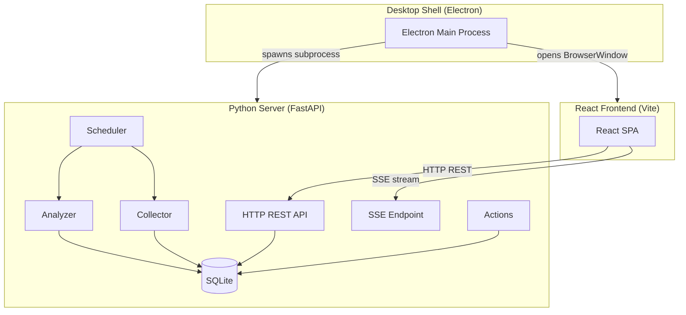
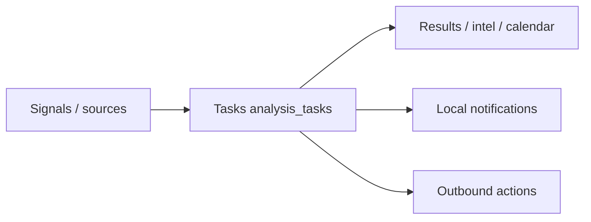
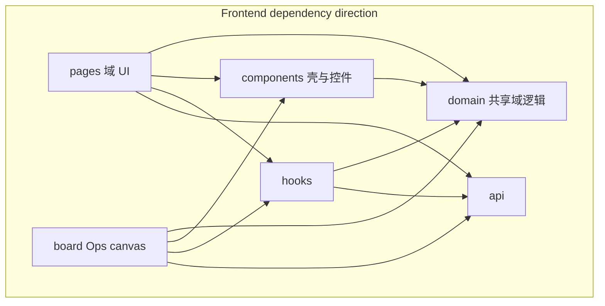

# Architecture

Intelligence Monitor is a three-component desktop application for monitoring, collecting, and analyzing messages from multiple platforms (Telegram, Discord, RSS, HTTP, MQTT, Email/IMAP) using LLM-powered analysis.

## System Overview



## Core design: Task as universal interface

**Analysis tasks (`analysis_tasks`) are the intelligence-work interface; standalone recurring series belong to the calendar domain.** Multi-source signals are selected via `task_channels` → configured as an analysis task (mode / prompt / trigger schedule) → consumed as results and actions. Downstream UIs (intelligence, timeline, board widgets, actions, local notifications) scope work via hierarchical source filters `{ taskIds, worksetIds }` (or a task whitelist) — ownership of handwritten／assistant calendar items is by `worksetId`, not a lone `taskId` / `taskId=__general__` sentinel.



| Task field role | Meaning |
|-----------------|---------|
| `mode` | **Open-loop:** `leaderboard` / `intel_event`（單次 LLM JSON → 結果表）. **Configurable Agent:** `agent`（`agent_tick`：觸發方式 + 工具／輸出權限；預設「專案調和」「網蒐」）. Calendar recurrence is not an analysis mode. |
| `task_channels` | Which collected channels feed the task (`leaderboard` / `intel_event` required; `agent` depends on `trigger_mode`: cursor required, threshold optional, schedule optional) |
| `version` | Invalidation boundary for batches / markers / findings |
| Schedule / RRULE | Unified RRULE-shaped description; AI modes persist trigger-purpose `schedule_rrule` (APScheduler only); recurring calendar series on `recurring_schedules.rrule` (query-time expand only) |
| `parent_task_id` | Optional FK on `recurring_schedules` for child `recurring` rows owned by an `agent` task with calendar output (`ON DELETE CASCADE`) |

**Naming对照（docs only, no wire rename）**

| Concept | Wire / id | Not the same as |
|---------|-----------|-----------------|
| Calendar recurrence | Standalone `/api/v1/calendar/recurring` series (RRULE) | Timeline UI `viewMode: "calendar"` (calendar vs gantt layout) |
| Board calendar widget | widget type `"calendar"` | Any task analysis mode |
| UI agent detail | `/tasks/:taskId/agent` (`analysisMode=agent` + `outputCalendar`) | Retired wire `analysisMode=project`; legacy URL `/tasks/:taskId/project` is retired (no redirect) |

Timeline `viewMode:"calendar"` and board widget `"calendar"` are layout ids, not analysis modes.

**In → Task → Out**

1. **In:** Collectors write `messages` for sources/channels (signal plane).
2. **Task:** Scheduler runs AI for `leaderboard` / `intel_event` via `execute_batch`, and `agent` via `agent_tick` (`AgentRuntime` + task policy for trigger/caps/outputs). Standalone calendar RRULE series expand only at read time.
3. **Out:** `analysis_events` (intel_event / agent when `output_analysis_events` is on) / leaderboard `trending_topics` (always, independent of that flag), board widgets, actions, and local notifications bind to task ids; `user_events` ownership is `workset_id` (NOT NULL, default `__general__`) with optional provenance `task_id`; agent `output_calendar` writes owned `user_events` + child `recurring` (`origin=agent`). Leaderboard tasks do not feed the Intelligence page.

**Task outputs (task editor only; not extra task types):** intelligence (`outputAnalysisEvents` — intel_event / agent; off skips `analysis_events` persist), time planning (`includeInTimeline` on dated analysis events), notify (`notifyPref` inherit／off), and Agent calendar write (`outputCalendar`, agent-only) in the same output group. Leaderboard always writes `/leaderboard` + may notify; the editor hides the Intelligence-page toggle. Items and user calendars keep their own date／notify overlays. Agent policy fieldset is preset + trigger + caps only. Builtin templates: two leaderboard jobs (熱門話題排行／討論熱度), eight intel_event jobs (關鍵情報／時間行程推理／IoT 設備告警／薅羊毛／行程事件提取／資安詐騙／政策法規／金融市場), plus four 專案經理 jobs (工作輪更／專案日程／來源核實／純網搜). In-editor Agent mode cards are 對帳日曆／來源 + 網搜／純網搜.

**Task-scoped UI vs exceptions**

| Surface | Scoped by |
|---------|-----------|
| Intelligence, Timeline (analysis), Leaderboard, board widgets, actions | Hierarchical `{ taskIds, worksetIds }` / task whitelist (`intel_event` / `agent`); builtin workset `__general__` for「一般」 |
| Local notification gate | `resolveNotify`: notification-page master + DND, then entity checkbox (`notifyPref` inherit／off), then `worksets.notify_enabled`. Leftover ui-prefs `sourceFilter` is ignored. Timeline source filter is unrelated (what to show, not what rings). |
| Monitor / Sources | Signal plane (sources/channels), not analysis tasks |
| Manual / assistant / A2A / agent / MCP calendar items | `user_events`: ownership via `workset_id` (builtin `__general__`); optional `task_id` provenance; origins `manual`／`assistant`／`a2a`／`agent`／`mcp`／`ics` |
| Shell prefs (board layout, assistant sessions, local-notify state, voice IO defaults) | SQLite via `/api/v1/ui-prefs/*` — not task rows |

## Components

### Python Server (`server/`)

The single backend process handling all business logic. Built with **FastAPI** running on **uvicorn**, listening on port **18820** by default (`SERVICE_PORT` in `server/constants.py`; FE `DEFAULT_API_PORT` / desktop `DEFAULT_SERVER_PORT` / `scripts/service-ports.mjs` stay in lockstep via drift tests).

| Module | Responsibility |
|--------|---------------|
| `api/` | HTTP route handlers (count from `scripts/project_stats.py` via `npm run stats`; health, **sources**, channels, messages, tasks, results, config, system, actions, logs, viewer, agent, weather, **calendar** (`window`／`holidays`／`imports`／`dismissals`／`user-events`／`recurring`／`importance`), worksets, items, llm, mcp, theme, ui-prefs, setup, access-keys, a2a, events SSE) |
| `api/schemas/requests/` | Pydantic request bodies (one module per domain; routes import from here — no inline request models) |
| `api/schemas/responses/` | Pydantic response models (package re-exports flat names) |
| `wire/serializers.py` | Facade re-exporting domain builders in `wire/serializer_domains/` (snake_case → camelCase; worksets in `serializer_domains/worksets.py`; shared by HTTP and non-HTTP callers) |
| `api/routes/weather.py` | Thin route over `services/weather.py` façade — providers in `weather_providers.py`, HTTP pool in `weather_http.py`, city aliases in `location_map.py` (shared with holidays) (`GET /api/v1/weather/*`) |
| `presets/task_presets.py` | Builtin **task template catalog** (`BUILTIN_PRESETS`) — loaded at runtime from [`shared/task_presets.json`](../shared/task_presets.json); locale copy synced via `scripts/sync_task_presets.py` (see [`docs/I18N-GLOSSARY.md`](I18N-GLOSSARY.md#任務模板-presets顯示文案-sot)) |
| `queries/` | Shared SQL helpers (`sources_queries`, `actions_queries`, `results_queries`, `tasks_queries`, `viewer_queries`, `messages_queries`, `version_sql`, …) |
| `analysis_control.py` | Unified pause / resume / abort for analysis batches |
| `db/` | SQLite persistence via aiosqlite — current baseline **v2** (`SCHEMA_SEMVER` `1.1.0`) DDL split under `db/schema_domains/` and aggregated by `db/schema.py` (fingerprint in `db/schema_fingerprint.py`), bootstrap／reject in `db/schema_bootstrap.py` plus additive runner in `db/schema_migrate.py` and production steps in `db/schema_steps.py`（`SCHEMA_FLOOR` 1 + `SCHEMA_MIGRATIONS` `1→2`; stamp-1 files backup-then-walk; future stamps hard-reject → update the app; never silent wipe）, connection/reset wrapper in `db/database.py`. Retired monolithic `schema_ddl.py` is gone. |
| `db/schema_inspect.py` | Schema fingerprint inspect + mismatch categories; version constants consumed by `schema_bootstrap` / `schema_migrate` / `schema_steps` |
| `household_auth.py` | Lightweight household auth: admin password → device session; revocable API keys (`*` / `read`) |
| `scheduler/` | APScheduler-based periodic analysis scheduling (`manager.py` + `manager_pipelines.py`), batch claim/process/fail (`batch.py` / `batch_claim` / `batch_process` / `batch_failure`), agent tick + cursor drain/wave (`agent_tick` / `agent_tick_drain` / `agent_tick_wave`), result persistence, multi-category data retention (`retention.py`) |
| `collector/` | Platform adapters — Telegram, Discord, RSS, HTTP poll, MQTT, Email (IMAP poll + UID cursors; helpers in `email_imap_fetch.py` / `email_imap_mailbox.py` / `email_imap_poll.py`) — with automatic reconnect/backoff |
| `collector/adapter_factory.py` | **Input registry:** `ADAPTER_BUILDERS` keyed by `domain/collector_platforms.COLLECTOR_PLATFORMS` → `build_adapter` |
| `domain/collector_platforms.py` | Leaf platform vocabulary (DDL + factory + FE mirror) |
| `domain/analysis_modes.py` | **Process registry:** `AnalysisModeSpec` / derived frozensets (DDL + FE mirror) |
| `collector/manager.py` | Public collector façade — source lifecycle, shared adapter registry, aggregate SSE status, and platform delegate entry points |
| `collector/manager_retry.py` | Internal `CollectorRetryOrchestrator` — owns auto-connect, SQLite-busy retry, deferred retry handles, and shutdown drain |
| `collector/manager_sources.py` | Per-platform collector connect/disconnect delegates (Discord / RSS / MQTT / Email); Telegram login/session flows live in `telegram_login.py` |
| `collector/capabilities.py` | Shared adapter capability wiring and platform feature flags |
| `collector/telegram_session.py` | Telegram auth persisted as Telethon `StringSession` in `{DATA_DIR}/sessions/{source_id}.session.txt` |
| `paths.py` | Unified Desktop／CLI data root (`INTELLIGENCE_MONITOR_DATA_DIR` or product userData); full reset clears sessions, secret.key, and connection.json |
| `collector/http_poll_helpers.py` | Shared helpers for HTTP poll adapter |
| `collector/email_imap_fetch.py` | IMAP fetch / UID cursor helpers (public entry remains `email_imap.py`) |
| `collector/email_imap_mailbox.py` | IMAP mailbox open／verify／multi-folder fetch／mark-seen helpers |
| `collector/email_imap_poll.py` | IMAP poll-once cycle + folder cursor／UIDVALIDITY persistence |
| `analyzer/` | AnalysisEngine + configurable LLM client façade (`llm_client.py` + `llm_client_factory` / `llm_client_handlers` / `llm_providers` / `llm_config`); connection settings resolve from `llm_profiles` (replaces retired dual-path global／`assistant_llm_*`); runtime `LlmConfig.web_search_api_keys` is keyed by provider (not parallel `brave_search_api_key` fields); analysis modes (`leaderboard` / `intel_event` oneshot LLM; `agent` multi-round ticks in `scheduler/agent_tick.py`); prompt **assembly** in `analyzer/prompt.py` |
| `prompts/` | **System / schema prompt** string library (`analysis` / `assistant` / `agent_task` / `clock` / …) + `locale.py` (UI locale normalize + output-language directive). Find wording here; assembly lives in `analyzer/prompt.py` / `agent/runtime_prompt.py` (facade `agent/runtime.py`) / `scheduler/agent_tick.py`. This is **not** the user-facing task template catalog — that lives in `presets/task_presets.py` and has zh-Hant UI locale as its display-text source of truth ([`docs/I18N-GLOSSARY.md`](I18N-GLOSSARY.md#任務模板-presets顯示文案-sot)) |
| `prompts/clock.py` | `current_time_prompt_block` — injects wall-clock context into analysis / agent prompts (deep-import by design; not re-exported from `prompts/__init__.py`) |
| `agent/` | Text Agent runtime + tool registry (`calendar.*` / `messages.search` / optional `web.search`; `POST /api/v1/agent/chat`); orchestration façade `runtime.py` with `runtime_prompt`／`runtime_complete`／`runtime_parse`／`runtime_tool_round`; see [Agent / assistant](#agent--assistant) |
| `agent/agent_scope.py` | Agent-tick tool argument scoping (`agent_scope_task_id`); calendar event writes use `origin=agent` (provenance enum, **≠** retired `analysis_mode=project`) via `channel_from_agent_spec` / `AGENT_CHANNEL` |
| `agent/tool_args.py` | Coercion for LLM-supplied tool arguments (int / bool / optional / camelCase-or-snake_case key aliases) — the one implementation every `tools_*` module uses |
| `web_search/` | Provider clients + `WebSearchExecutionService` + constrained `web.fetch`. Vocabulary／secret columns／wire names SoT: `domain/web_search_providers.py` (DDL CHECK, Pydantic mixins, serializers, FE `assistantWebSearchRoute.ts` drift-tested). Per-engine modules (`duckduckgo`／`brave`／`tavily`／`perplexity`／`serper`); `providers.py` is the public facade that assembles the `KeyedSearchSpec` table (no parallel HTTP POST copies). Outbound SSRF is `outbound.validate_outbound_url` for search, fetch, and LLM. Agent ticks via AgentRuntime; count / master-switch as params |
| `queries/messages_queries.py` | Shared message list filters + cursor page (REST + Agent) |
| `calendar/` | Shared calendar package: `query` (+ `query_fetch`／`query_merge`), `rrule` façade (`rrule_validate`／`rrule_expand_*`), `normalize`, `ics` (+ `ics_event`), `imports` (+ `imports_upsert`), plus user-event services (`user_events_read`／`user_events_write`／`user_events_normalize`) + `timeline_dismissals.py`. HTTP under `api/routes/calendar/` (`window`／`holidays`／`imports`／`dismissals`／`importance`／`user-events`／`recurring`). Retired `GET /api/v1/calendar/items` and `GET /api/v1/calendar/occurrences` are 404. |
| `services/task_writes.py` | Shared task and series write validation: trigger/calendar RRULE canonicalization, parent-agent invariant, and `HH:MM` clock normalization |
| `services/task_policy.py` | HTTP-agnostic task write policy (`ALLOWED_MODES`, agent-policy fields, workset resolve, require-row); routes map `TaskWriteError` → 422 |
| `services/task_crud.py` | Task CRUD façade (`task_crud_list` / `task_crud_mutate`) for REST catalog + mutations |
| `services/recurring_series_writes.py` | Standalone recurring-series write façade (`create` / `patch` / hard delete) |
| `time_iso.py` | UTC ISO-8601 helpers (`Z` form) for parsing/formatting timestamps |
| `calendar/user_events_read.py`／`user_events_write.py` | Shared read／write halves for manual UI + assistant calendar tools (wire shape via `wire/serializers.serialize_user_event`; single-row query stays in `queries/calendar_queries.fetch_user_event`) |
| `actions/` | Automated responses — Telegram send, Discord send, HTTP webhook, MQTT publish |
| `outbound.py` | Outbound notify dispatch helpers used by actions |
| `ingestion.py` | Shared message ingestion (channel upsert + dedup insert) |
| `auth.py` | Bearer auth: API key **or** device access token; localhost bypass; remote write gate |
| `device_auth.py` | Device-session façade — token issue (`device_token_issue`) + session verify/list (`device_session_ops`) |
| `admin_auth.py` | Singleton admin account (argon2 hash / verify) |
| `sse.py` | SSE event broadcaster (`/api/v1/events`; route module in `api/routes/events.py`); `publish_resource_modified` is the only place the `resource_modified` payload is built (REST routes via `api/deps.py`, agent writes via `agent/tools_registry.py`) |
| `errors.py` | Global exception handlers producing structured error responses |
| `config.py` | `system_config` key-value access with defaults and clamping |
| `main.py` | FastAPI app factory and lifespan owner of startup geocode backfill; drains the task before dependent resources close; uvicorn entry point (`python -m server`) |

### Managed-task lifecycle ownership

| Owner | Managed work | Shutdown boundary |
|-------|--------------|-------------------|
| FastAPI lifespan (`server/main.py`) | Startup geocode backfill handle | Cancels/awaits backfill before scheduler, collector, engine, executor, and database close |
| `SchedulerManager` (`server/scheduler/manager.py`) | Dispatch, retention, and in-flight batch tasks | Stops producers, allows bounded grace, then cancels/gathers batches before processing-row invalidation |
| `CollectorManager` façade (`server/collector/manager.py`) | Shared adapter registry, aggregate status, and disconnect coordination | Awaits its retry delegate before disconnecting adapters |
| `CollectorRetryOrchestrator` (`server/collector/manager_retry.py`) | Auto-connect and per-source deferred retry handles | Sets shutdown guard, snapshots, cancels/gathers, then identity-clears handles |

The collector manager delegates in `collector/manager_sources.py` and `collector/manager_retry.py` retain platform-specific entry points and retry orchestration; they do not own a second adapter registry.

### API error codes (i18n prep)

User-visible API failures should prefer a stable snake_case `error_code` in the structured body (`error_code` / `message` / `details` / `correlation_id`). Prefer `server.errors.http_error(...)` over bare Chinese `HTTPException(detail=...)`.

The web client (`web/src/utils/errors.ts` → `toErrorMessage`) looks up `messageForErrorCode` (`web/src/i18n/errorCodes.ts`) first, then falls back to `message`. See [`docs/I18N-GLOSSARY.md`](I18N-GLOSSARY.md) for the glossary and pilot codes (`weather_*`, `agent_timeout`).

The server integrates collector, analyzer, and action modules as direct in-process function calls — no inter-process communication layer.

### React Frontend (`web/`)

A **React** SPA (Vite + TypeScript). Talks to the server **only** via HTTP REST + SSE.

- **Build**: Vite (dev proxy, production static bundle).
- **Styling SoT**: `web/src/styles/themeCatalog.ts` + `npm run gen:themes`. Runtime `html` attrs (`data-theme`, `data-theme-mode` / `family` / `texture` / `bg`). Photo-BG / focal Bing / surface frost: [`KNOWN-SIMPLIFICATIONS.md` Theme focal / Photo-BG](KNOWN-SIMPLIFICATIONS.md#cross-layer-contract-quirks-do-not-fix-without-updating-the-client). Tailwind v4 utilities + `web/src/components/ui/`; `tokenCompliance` ratchet. Unknown theme IDs fallback via `resolveThemeId`.
- **Communication**: HTTP REST for commands/queries, SSE for server-pushed events.
- **Scrolling**: `body` / `#root` `overflow: hidden`; page scroll on `.app-shell-main`. Infinite-scroll / monitor virtualizer must use `getVerticalScrollParent` / `useScrollContainerState` (`web/src/utils/scrollParent.ts`) — not `window.scrollY`.
- **SPA vs HTTP names:** notifications UI is `/notify` (`pages/notify/`, label **通知**). Outbound automation HTTP stays `/api/v1/actions*` — do **not** rename `Action*` identifiers. Channel picker ≠ ActionType tiles: [`I18N-GLOSSARY.md` Channel／ActionType](I18N-GLOSSARY.md#channelactiontype-命名). Local notify scanner: `web/src/domain/notify/` (terms: glossary **通知**／語音／畫面).
- **Assistant / AI**: `/assistant` + `/ai/*` (`web/src/pages/ai/`). Sessions `GET/PUT /api/v1/ui-prefs/assistant/sessions`. Contracts: [`assistant.md`](agent/assistant.md)、[`a2a.md`](agent/a2a.md)、[`mcp.md`](agent/mcp.md)、[`agent.md`](agent/agent.md) (tick UI `/tasks/:taskId/agent`; legacy `/project` retired, no redirect).
- **Account**: `/account/identity|devices|keys` (no `/profile` redirect).
- **UI prefs:** voice IO / local-notify / timeline annotations hydrate from SQLite only — empty server → defaults／empty. Per-feature LS migrate bridges are gone; one-shot `clearLegacyPrefsIfNeeded` / `im:prefs-schema-version` remains. User profile: server settings SoT + active LS cache.
- **Ops board** — see [Ops board](#ops-board) below.

#### Frontend layering

Dependency direction (allowed):



| Layer | Path | Role |
|-------|------|------|
| Pages | `pages/` | Route-level UI composition only |
| Domain | `domain/` | Pure domain logic / constants (no React page ownership) |
| Components | `components/` | Shared shells, controls, detail builders |
| Board | `board/` | Ops canvas widgets (must not import `pages/`) |
| Hooks | `hooks/` | Reusable React hooks |
| API | `api/` | HTTP / SSE client boundary |

Constants moved into domain include: `taskPageCopy`, `userEvents`, `workspaceNav`, `analysisEvidenceStyle`, `commandPaletteCommands`, `systemTaskCatalog`.

**Domain boundaries (board／shell slices):**

| Slice | Path | Consumers |
|-------|------|-----------|
| Timeline date helpers | `domain/timeline/dateUtils` | Calendar board embed／widget；timeline pages may re-export |
| Map filters／tiles／coord group | `domain/intelligence/mapFilters`、`mapTiles`、`groupByCoordinate` | Board map embed + intelligence map |
| Wall layout／model | `domain/monitor/wall/` | Wall board embed + Monitor wall |
| Command palette catalog | `domain/commandPalette/commandPaletteCommands` | Command palette UI／hooks |
| System task catalog | `domain/tasks/systemTaskCatalog` | Tasks page system cards |
| Month weather hook | `hooks/useMonthWeather` | Weather board widget + Timeline month grid |
| Month holidays hook | `hooks/useMonthHolidays` | Timeline calendar overlay (same weather location) |
| Map markers UI | `components/map/` | Map board embed + MapView |
| Timed event merge | `domain/timeline/timedEventMerge` | Board calendar/gantt/events + timeline window projectors |
| Source filter dialog | `components/SourceFilterDialog` | Board widgets + timeline/intelligence/voice toolbars |

**Forbidden**: `hooks/` and `components/` must not import from `pages/` (enforced by `tests/smoke/architecture-invariants.test.ts`). Shared helpers that hooks or components need belong in `domain/` (or lower), not under a page folder. `board/` must not deep-import `pages/*` (also ESLint).

#### Ops board

- **Display vs code:** UI label SoT [`I18N-GLOSSARY.md`](I18N-GLOSSARY.md)（畫布 / Ops Board）. Wire: mode=`canvas`, prefs=`ops_board_*`, code `web/src/board/` (`BoardRoot`). CSS `web/src/css/board-*.css`.
- **Persistence:** SQLite `ui_prefs` via `GET/PUT /api/v1/ui-prefs/board` — `layout` (mosaic `version` + `widgets`; **v17** / `BOARD_LAYOUT_VERSION`) and `widgetState` `{ mapViews, sourceFilters, ganttViewModes }` (FE `BoardSourceFilterPref`; retired `taskFilters`). Empty server (`configured: false`) → seed default mosaic + empty widgetState (no LS migrate). Still device-local: `im:monitor-mode`, `im:pages-last-path`.
- **Layout version:** older layouts **migrate in place** (`migrateBoardLayout`): keep known `widgetRegistry` types, drop unknown, bump to `BOARD_LAYOUT_VERSION`. Version lag alone does not wipe a custom layout. Hydrate write-backs when parse/normalize changes the blob.
- Shared timed-event projectors: `domain/timeline/timedEventMerge`. Source filter: `components/SourceFilterDialog` (`{ taskIds, worksetIds } | null`). Board RRULE / `item_remind` filter aligns with Timeline (`worksetId` ownership).
- Default mosaic widget set lives in `web/src/board/` (`widgetRegistry` / `BOARD_LAYOUT_VERSION`) — not duplicated here.

### Desktop Shell (`desktop/`)

A thin **Electron** wrapper that provides the native desktop experience:

1. Spawns the Python server as a child subprocess
2. Waits for the server health check endpoint to respond
3. Opens a `BrowserWindow` pointing at the server's URL
4. Provides system tray icon and lifecycle management
5. Kills the Python subprocess on application quit
6. **Calendar import (one-shot):** OS `.ics` file association + `intelligencemonitor://calendar/import` deep link → Electron bounds/decodes and forwards the original ICS over preload IPC → React calls `/api/v1/calendar/imports/preview` → user selects supported items → one `/commit` transaction writes one-time events to `user_events` and RRULE series to standalone `recurring_schedules`. Commit emits resource invalidation so Timeline／Board／Gantt refresh from their normal APIs. Not a calendar sync client (no webcal subscription／CalDAV／Google OAuth).
7. **Packaging:** First-class Desktop delivery is **Windows NSIS**, **macOS DMG/zip**, and **Linux AppImage/deb** (`desktop/electron-builder.yml`). **CLI** is source: the same headless entry as `python -m server`／`intelligence-monitor` (`uv sync --locked` then run). GitHub Release does **not** attach CLI zips. The PyInstaller sidecar (`desktop/server-runtime/`) is for **Desktop only** and must be built on the **target OS** (no cross-compile). PRs run Ubuntu `quality` + build only (`.github/workflows/ci.yml`). **`push` to `main`** runs `.github/workflows/release.yml` in one pipeline: quality, SemVer bump (inject into build workspace only — **no** bot commit to main), **`git tag` + `git push`** (existing tag → `-update.<run_number>`), one Ubuntu Vite (`web_dist` job; stages `web-dist.tar.gz` on the GitHub Release, not Actions artifacts — private-repo quota), then the `package` matrix (win／mac／linux reuse that bundle via `dist:*:native` + `verify:desktop:full` [= `desktop_verify` only; desktop vitest stays in `quality`]), GitHub Release (Desktop installers; missing assets fail; staging zip is deleted; installers are **not** Actions artifacts), and GHCR. Local `dist:win`／`dist:mac`／`dist:linux` still run `build:web` first. **Product version authority is git tags**; repo `VERSION` may lag. Schema stamp／`SCHEMA_SEMVER` are DB-contract identities and need not equal the product tag.

**Headless container (GHCR):** `Dockerfile` ships the FastAPI server + built SPA (no Electron). Data volume `/data`; see `docker-compose.yml` and `npm run docker:build`. GHCR push follows **Release on `push` to `main`**; PRs never publish an image. Dockerfile `HEALTHCHECK` + CI deploy smoke cover post-publish readiness.

The desktop shell still contains no calendar business parser. RFC 5545 interpretation, preview diffs, UID idempotency, and the transaction live in the Python server.

#### ICS import support and limits

Moved to [`docs/DESKTOP-ICS.md`](DESKTOP-ICS.md) — supported RFC 5545 subset, size/event limits, persistence/idempotency, floating-time behavior, and the remote-URL (anti-SSRF) download policy.

#### Weather best-effort behavior

Month weather is optional decoration, never a calendar availability dependency. Hook + server window/cache: `hooks/useMonthWeather` + `GET /api/v1/weather/forecast`. Failures stay in hook diagnostics — no Timeline toast, no blocked Calendar／Board.

Public holidays overlay: [`KNOWN-SIMPLIFICATIONS.md` Calendar holidays](KNOWN-SIMPLIFICATIONS.md#sources).

## Scripts (`scripts/`)

Operational and packaging helpers invoked from npm scripts or CI:

| Script | npm alias | Purpose |
|--------|-----------|---------|
| `dev.mjs` | `npm run dev` / `dev:web` | Local web + server (or web-only) orchestrator |
| `dev-utils.mjs` | — | Shared helpers for `dev.mjs` (health polling, child-process teardown); re-exports the port constants |
| `service-ports.mjs` | — | Node-side SoT for `SERVICE_PORT` (18820) / `VITE_PORT` + `defaultApiBaseUrl()`; drift-tested against `server/constants.py`. Types live in the sibling `service-ports.d.mts` |
| `build-web.mjs` | `npm run build:web` | Vite production build for `web/` (root orchestration; CI also runs `web` package `typecheck`) |
| `build_server_sidecar.py` | `npm run build:server-sidecar` | PyInstaller one-dir bundle for the Electron sidecar (`desktop/server-runtime/`); keeps `tzdata` data + `sse_starlette` submodules |
| `package_cli.py` | `npm run package:cli` | Optional local zip of the sidecar onedir. **Not** a GitHub Release artifact — CLI ships as source |
| `clean.mjs` | `npm run clean` | Remove reproducible build outputs and Node/Python caches across workspaces |
| `smoke.py` | `npm run verify:deploy` (`smoke` alias) | Short post-deploy live check against `:18820` (health／SPA／core API／SSE) |
| `project_stats.py` | `npm run stats` | Route/module counts for docs and drift checks |
| `desktop_verify.py` | `npm run verify:desktop:full` (also used by `verify:desktop:fast` after vitest) | Desktop build-path checks for the current OS; full mode requires packaged sidecar, unpacked runtime, and the platform installer (NSIS／DMG／AppImage or deb). Does **not** re-run desktop vitest. |
| `reset_local_databases.py` | — | Delete local SQLite files for a clean stamp-2 start |
| `live_eval_pipeline.py` | — | **Dev-only:** live Telegram + Gemini + Serper pipeline eval against a running local server. Implementation lives in `scripts/live_eval/` (`pipeline.py` orchestrator; `setup.py` / `poll.py` / `teardown.py`). Not a product path — not used by CI, packaging, or runtime. Writes `scripts/.live_eval_state.json`. |
| `seed_calendar_ui_fixtures.py` | — | **Dev-only:** seed Timeline／Calendar UI fixtures (`[cal-ui]` prefix); not used by CI or product runtime |
| `seed_dev_items_calendar.py` | — | **Dev-only:** seed items + calendar rows for manual UI checks (`[dev-seed]` prefix); not used by CI or product runtime |
| `seed_items_finance_demo.py` | — | **Dev-only:** seed items + linked calendars (all 3 `kind`s) + `purchase_effective` finance amounts (`[finance-demo]` prefix); not used by CI or product runtime |
| `seed_trace_correct_demo.py` | — | **Dev-only:** seed Intelligence source-quote / 「不是情報」/ Timeline dismiss / Agent 「收回最近一次調和」 fixtures (`[demo]` prefix); not used by CI or product runtime |
| `_seed_common.py` | — | Shared scaffolding for the dev-only `seed_*.py` fixtures (`run_seed_cli` + cleanup, workset, LLM profile, task/event builders, linked-calendar helpers) |
| `sync_task_presets.py` | `npm run sync:presets` / `sync:presets:check` | Sync `BUILTIN_PRESETS` display text from zh-Hant locale (CI drift check) |
| `sync-version.mjs` | `npm run sync:version` | Propagate root `VERSION` into package.json／pyproject／package-lock workspace entries |
| `bump_version.py` | — | Next SemVer (`X.Y.Z-beta.N` → `N+1`; `X.Y.Z` → patch+1). With `--from-tags` and no `v*` tags, returns `VERSION` as-is (first release). Default／`--print-only` never write; explicit `--write` updates `VERSION`. CI uses `--from-tags --print-only` (tag authority). |
| `check-i18n-parity.mjs` | `npm run i18n:check` | Locale key parity vs zh-Hant SoT |
| `export_openapi.py` / `openapi-check.mjs` | `npm run openapi:export`／`openapi:check` | Export live OpenAPI + drift check vs committed `web/openapi/` |
| `generate-theme-css.mjs` / `generate-theme-textures.mjs` | `npm run gen:themes`／`gen:textures` | Theme CSS／texture asset generators (also invoked from `build-web`) |
| `run-pyright.mjs` | `npm run typecheck:server` | Run pyright with `--pythonpath` pinned to the uv `.venv` (bare `pyright` would pick PATH's dependency-free python) |
| `_verify_common.py` | — | Shared HTTP helpers for smoke／desktop_verify live scripts |
| `measure_startup_baseline.py` | — | Repeatable ASGI fresh-db startup timing (optional local perf probe) |

Python helpers are run via `uv run python scripts/...` from the repo root (see root `package.json`). Node helpers (`*.mjs`) are invoked via `node scripts/...`.

## Data Flow

### Commands (user-initiated)

```
React Frontend  ──HTTP REST──▶  Python Server  ──direct call──▶  Module (collector/analyzer/actions)
                                                ◀── return ────
                ◀──HTTP Response──
```

1. The frontend sends an HTTP request to a FastAPI route handler.
2. The handler executes business logic directly — querying the database, calling collector/analyzer/action modules as regular async Python functions.
3. The handler returns an HTTP response to the frontend.

### Events (server-initiated)

```
React Frontend  ◀──SSE──  Python Server
```

The server pushes real-time updates to the frontend via Server-Sent Events. The frontend maintains a persistent SSE connection. Resource／status payloads are HTTP-style camelCase (`adapterName`, `errorSummary` on `collector_status_changed`); error-body fields `error_code`／`correlation_id` stay snake. Event types:

| Event | Trigger |
|-------|---------|
| `messages_updated` | New messages collected from a platform |
| `collector_status_changed` | Collector subsystem status change |
| `source_status_changed` | Source connection/disconnection |
| `analysis_started` | Analysis batch begins processing |
| `analysis_completed` | Analysis batch finished successfully |
| `analysis_failed` | Analysis batch encountered an error |
| `analysis_paused_changed` | Global analysis pause state changed |
| `resource_modified` | Generic resource change notification |

## Database

**SQLite** via **aiosqlite** — a single `.db` file with tables including:

| Table | Purpose |
|-------|---------|
| `sources` | Collector connection credentials and status |
| `channels` | Monitored channels/feeds |
| `source_channels` | Source ↔ channel associations |
| `messages` | Collected messages from all platforms |
| `analysis_tasks` | Shared task definitions (`leaderboard` / `intel_event` / `agent`), trigger-purpose `schedule_rrule` for AI timers, agent policy columns (`trigger_mode` / caps / outputs; stamp **19**), and AI scheduling overrides; contains no recurring calendar payload columns (standalone series live on `recurring_schedules`) |
| `recurring_schedules` | Standalone calendar series: identity/name/workset/active state, RRULE, DTSTART/DTEND, timezone/all-day/location/description, recurrence dates, ICS identity, and optional project/item parent |
| `task_channels` | Task ↔ channel associations |
| `analysis_batches` | Individual analysis run records |
| `analysis_markers` | Incremental analysis cursor (message analyzed markers) |
| `trending_topics` | Extracted trending topics from analysis |
| `topic_messages` | Topic ↔ message associations |
| `analysis_events` | Unified event findings (optional `start_time` + optional map coordinates) |
| `user_events` | One-off timed events (`origin`: `manual` REST/UI, `assistant` Agent tools, `agent` agent ticks, `a2a` A2A agent channel, `mcp` MCP tool channel (stamp **30**+), `ics` one-shot imports; `workset_id` NOT NULL ownership; optional `task_id` provenance; `kind` (`normal`\|`expires`\|`purchase_effective`); optional finance `amount` + `direction` (`expense`\|`income`, only for `purchase_effective`); imported UID/source/fingerprint + all-day/TZID metadata). REST `DELETE /calendar/user-events/:id` **hard-deletes** the row (Schedule / Items trash). Timeline 「從時間規劃移除」 is `PUT /calendar/dismissals`, not this DELETE. |
| `timeline_dismissals` | Soft-dismiss markers for timeline (`source` + `event_id`; does not delete source rows). Restore via `DELETE /calendar/dismissals`. Independent of REST hard-delete of `user_events` / `recurring_schedules`. |
| `admin_accounts` | Singleton household admin (normalized username + argon2 password hash) |
| `device_sessions` | Device sessions (refresh token hash, expiry, revoke) |
| `device_access_tokens` | Short-lived opaque access token hashes bound to a device session |
| `access_api_keys` | Household API keys (secret hash only; plaintext once on create; `scopes` / `last_used_at`) |
| `ui_prefs` | UI-pref JSON blobs (`key` PK; board / notify / timeline / assistant sessions) |
| `system_config` | Key-value scalars / small secrets only (not multi-row entities or large blobs) |
| `app_logs` | Application log entries (Settings→Logs). Write only via `server.app_logging.record` / FE `recordAppLog`. Soft categories include `source` (wired for connect/runtime failures as kind `source.error`). |
| `actions` | Automation action definitions |
| `action_trigger_history` | Action execution audit trail; read via `GET /api/v1/actions/trigger-history` |
| `agent_message_cursors` | Per-agent `message_cursor` last-seen message cursor for `agent_tick` (`last_message_at` ISO + optional `last_message_id` same-second tie-break) |
| `worksets` | Ownership dimension (`id` / `name` / `is_system` / `notify_enabled` / `external_enabled` INTEGER NOT NULL DEFAULT 1); builtin `__general__` (`is_system=1`; both flags can be turned off). Worksets page is the permission hub; `analysis_tasks.workset_id` NOT NULL DEFAULT `__general__` (delete_workset reassigns first); `user_events`／`items.workset_id` `NOT NULL DEFAULT '__general__'` (delete_workset reassigns before delete) |
| `item_categories` | Soft-template categories (`slug`, optional `emoji`, `default_remind_before_days`); seed rows with stable slugs + emoji logos. Categories group items and supply default remind hints only — no `field_schema` / attribute presets. |
| `items` | Trackable inventory (optional `emoji`; optional `quantity`／`unit`; free-form details in `notes`); ownership via `workset_id`. **No item-level `price` or `attributes_json`** — purchase／effective amounts live on linked `user_events` with `kind=purchase_effective` (`amount` + `direction`). **Items date model:** linked `user_events` with `kind=expires` are the source of truth (title presets 到期／Expires are UX only). Stamp **28** dropped cache columns `expires_at`／`remind_before_days`; wire `expiresAt`／`remindBeforeDays` on ItemResponse are **derived on read** from the primary linked expires event (non-dismissed, earliest `created_at`). No write-through sync — expiry authority is `user_events.kind=expires` (`server/calendar/user_event_kinds.py` + items derive-on-read queries). There is no `purchased_at` column. Calendar `source=item_remind` projects remind DATE only as floating all-day (`itemDateKind=remind`; occurrence ids still `item:{id}:remind`) |

#### Calendar delete vs timeline remove

Three verbs — do **not** collapse them:

| Verb | Surface | Effect |
|------|---------|--------|
| REST `DELETE /calendar/user-events/:id` | Schedule / Items trash | **Hard-delete** the `user_events` row (gone from every list). Recurring series use REST `DELETE` of the series. |
| REST `PUT /calendar/dismissals` | Timeline 「從時間規劃移除」 | Timeline **remove**: insert `timeline_dismissals`; source row stays. Restore via `DELETE /calendar/dismissals` (UI 「顯示已移除」). |
| Agent / MCP `calendar.delete_event` | Assistant / A2A / MCP | **Soft-dismiss** (same `timeline_dismissals` path as PUT dismissals). Payload `dismissed: true`. Not a hard-delete. Hard-delete a series with `calendar.delete_recurring_series`. |

#### Calendar on timeline (source vs item-linked kind)

Timeline window rows use wire `source`; item linkage and `user_events.kind` are orthogonal:

| Timeline row | Meaning |
|--------------|---------|
| `source=analysis` \| `recurring` | AI / task intel (analysis findings or RRULE occurrences) |
| `source=user` + no `itemId` | True general calendar (`user_events`) |
| `source=user` + `itemId` | **Item-linked** calendar on that item; `kind` = `expires` \| `purchase_effective` \| `normal` |
| `source=item_remind` | **Remind DATE projection only** (`itemDateKind=remind`); derived on read from linked expires + remind-before — **not** the same as item-linked `user_events`. Dismissals／importance CHECK uses `item_remind`; occurrence ids remain `item:{id}:remind` |

`kind` on item-linked user events drives system behavior (expiry derive-on-read, finance amount/direction), not UI-only labels. Title presets (到期／Expires／购入／…) remain UX defaults. Do not confuse `source=item_remind` (projection) with `source=user` + `itemId` (editable linked calendars).

### Schema baseline (stamp 2)

Stamp / floor / support matrix / explicit reset: [`SCHEMA-BASELINE.md`](SCHEMA-BASELINE.md). Stamp 1 is the floor; stamp 2 is current (`schema_meta`); production `SCHEMA_MIGRATIONS` is `1→2` (not an empty registry, not a wipe-only current baseline).

### Schema product shape

Stamp 2 adds `schema_meta` (`id=1`, `schema_semver`). Tool web-search providers are `duckduckgo`／`brave`／`tavily`／`perplexity`／`serper` (plus `auto` for native). Tavily／Perplexity／Serper keys live on `llm_profiles` like Brave. Missing keyed-search keys fail closed (no silent DuckDuckGo fallback). `web.fetch` reads 1–2 public HTML pages per turn when tool search is on. Card glyphs live on entity columns: `analysis_tasks.emoji`, `user_events.emoji`, `recurring_schedules.emoji`, and existing `items.emoji` (NULL = product logo). Retired `ui_prefs` keys `schedule_emojis`／`task_emojis`; HTTP `/api/v1/ui-prefs/schedule/emojis` and `/api/v1/ui-prefs/tasks/emojis` are 404. `GET /api/v1/calendar/window` is SoT for time-window reads (Timeline／Board display and notify scan; tagged occurrences `source`: `analysis`｜`user`｜`recurring`｜`item_remind`). Intelligence/map keep `GET /api/v1/results/events`. User-events／recurring CRUD stay for 我的日程 editors. Write tables stay split (`analysis_events` vs `user_events`); recurring series still RRULE-expand rather than materializing every instance. Builtin workset id is `__general__` (`SYSTEM_WORKSET_ID`; display name 「一般」). `analysis_tasks`／`items`／`user_events`／`recurring_schedules.workset_id` TEXT NOT NULL DEFAULT `__general__`; `delete_workset` reassigns to `__general__` (no SET NULL; no `__user__` alias). `user_events.notify_pref` and `recurring_schedules.notify_pref` TEXT NOT NULL DEFAULT `'off'` (align create-omit and `DEFAULT_CALENDAR_NOTIFY_PREF`). `analysis_tasks.notify_pref` DEFAULT `'inherit'`. Worksets DDL lives in `schema_domains/worksets.py` and precedes `tasks` in `DDL_PARTS` (`analysis_tasks.workset_id` FK). `worksets.external_enabled` INTEGER NOT NULL DEFAULT 1 (MCP/A2A shared visibility; empty set fail-closed). `worksets.notify_enabled` and `external_enabled` are owned by the Worksets page hub (builtin 「一般」 can turn both off). Retired `system_config` keys `mcp_workset_scope`／`mcp_workset_ids`. Remaining `ui_prefs` keys are `notify_settings`／`notify_fired`／`notify_trigger_history` plus board／assistant／timeline annotations (retired `voice_reminder_*`; no in-place remap). HTTP SoT is `/api/v1/ui-prefs/notify/{settings,fired,history}` — retired `/api/v1/ui-prefs/voice-reminder/*` is 404. Wire `notifyPref` is `inherit`／`off` only; `"follow"` and `"on"` are 422 (no synonym). `notify_pref` CHECK is `inherit`／`off` on `user_events`／`recurring_schedules`／`analysis_tasks` (entity checkbox; no force-on). `analysis_tasks.output_analysis_events` defaults ON as the all-mode intelligence hard gate (non-agent create omits → on; batches skip `store_results` when off). **every** DB enum CHECK is generated from a Python domain SoT (`server/domain/`) with a drift test — LLM `provider`／`staff_class`／`json_mode`／`web_search_provider`, calendar `kind`／`direction`／`origin`, timeline `source`, `action_type` + action-history `status`, `trigger_mode`, batch／source／item `status`, `analysis_time_range`, app log `level`, nullable `analysis_strategy_mode`, and `notify_pref`. No `llm_profiles.is_default`／make-default APIs; no `assistant` in `llm_staff_instances`; global slots (assistant／liaison／taskEditor) hard-bound. Fresh DDL seeds **zero** profiles (no bootstrap `__default__`). Task create／update／activate need a complete usable profile; assistant／A2A／task advisor resolve require their bound slot. Analysis modes are only `leaderboard`／`intel_event`／`agent` — recurring is **not** an analysis mode. Categories remain soft templates; free-form item details live in `notes`. Assistant must call `items.list_expiring` for expiry questions (no invention). Board widget type remains `"actions"` (HTTP outbound `/api/v1/actions*`, not the SPA `/notify` page).

**`system_config` policy:** scalars and small non-LLM secrets only. LLM connection settings live in `llm_profiles` (column-encrypted keys). Multi-row entities, queryable secrets, or large JSON blobs belong in tables (device tokens, access keys, `ui_prefs`).

**Not planned:** merging `analysis_events` with `user_events`; hard per-category schemas; stock/qty ledgers; restoring CalDAV; renaming HTTP `/api/v1/actions*` to SPA `/notify`.

### Unified event analysis pipeline

- Finding modes that write ``analysis_events``: **`intel_event`** (message-batch oneshot) and **`agent`** when ``output_analysis_events`` is on. **`leaderboard`** always writes ``trending_topics`` for `/leaderboard` (and notify); it never writes ``analysis_events`` and has no intel icon on the household graph (排行榜 is the mode’s own page). Timed analysis rows also honor ``includeInTimeline``. Legacy `web_intel` / `project` modes were wiped into `agent` at stamp **18**.
- Workset pipeline graph: L1 sources+items → L2 tasks+assistant → L3 worksets → L4 shared output legend (timeline / intelligence / notify / external). **我的日程 is not a graph block**. SoT: `web/src/domain/worksets/pipelineGraphLegend.ts` / `pipelineIds.ts`.
- LLM JSON schema requires `title` + `body`; `start_time`/`end_time`/`location`/`participants` are optional.
- Location may be inferred from context; global/online/unspecified places (and missing location) persist as coordinates `0,0`. Time fields are filled only when a schedulable time exists. Evidence style (`analysisStrategyMode`) still controls which items to emit.
- Persistence: timed rows UPSERT on `(task_id, version, event_key)`; untimed rows `INSERT OR IGNORE` on `(task_id, version, content_hash)` with `semantic_hash` near-dedup.
- Geocode runs when an item has a usable `location` and missing coordinates (not gated by legacy task mode).
- Time-window SoT: `GET /api/v1/calendar/window` for Timeline, Board calendar/gantt, and notify scan (server-merged analysis, RRULE occurrences, `user_events`, and `item_remind`). `/results/events` (`hasTime`, `hasCoords`, `startDate`／`endDate`, sort, offset pagination — HTTP camelCase only) is intel/map only. User-events／recurring CRUD stay for 我的日程 editors; Agent／MCP expand via Python `query_window`／`expand_active_calendar_occurrences` (retired `GET /api/v1/calendar/occurrences` is 404).
- UI keeps **/intelligence** and **/timeline** as separate pages. **/items** is a peer page (visible in simple mode) for trackable inventory. Toolbar source filter: **全部** (`null`) = all sources; selecting a workset includes that workset’s user_events **and** items (no isolated items bucket); selecting a concrete **intel_event / agent** analysis task = that task’s analysis rows **plus** `user_events` with matching provenance `task_id`; selecting a **recurring series** = that series’ RRULE rows **plus** matching provenance. Gantt activity-spans emit **one row per workset** with user events (`sourceKind=workset`, `worksetId` = workset id, `taskId=null`) alongside analysis-task rows (`worksetId=null`); board gantt filters prefer `worksetId`+`sourceKind` and label `__general__` as「一般」.

### Schema support matrix

Moved to [`docs/SCHEMA-BASELINE.md` Schema support matrix](SCHEMA-BASELINE.md#schema-support-matrix).

The file defaults to `{DATA_DIR}/intelligence_monitor.db` and can be overridden with `INTELLIGENCE_MONITOR_DB`.

### Local data root

Desktop and CLI share one writable data root (Electron `productName` / `server.paths.default_data_dir`):

```
{DATA_DIR}/                          # Win: %APPDATA%\Intelligence Monitor
  intelligence_monitor.db
  secret.key
  connection.json          # Desktop shell (host/client) + optional resetPasswordForLocal
  sessions/{source_id}.session.txt
```

Desktop host sidecar sets `INTELLIGENCE_MONITOR_DATA_DIR` to Electron `userData` (same folder when packaged). CLI／`npm run dev`／`npm run dev:server` spawn Python **without** that override, so they also use `server.paths.default_data_dir()` (same `%APPDATA%\Intelligence Monitor` on Windows). Optional `INTELLIGENCE_MONITOR_SESSIONS_DIR`／`INTELLIGENCE_MONITOR_DB` override individual paths. Full reset／wipe only touches the active data root (no pre-beta home scan).

**Dev shell vs SQLite:** `npm run dev` also launches Electron with `--dev` (no sidecar). That Electron process uses Chromium `userData` under `%APPDATA%\intelligence-monitor-desktop` (package.json `name`) for Local Storage／disk caches only — **not** the SQLite file. `scripts/reset_local_databases.py` wipes SQLite candidates (including the active `default_db_path()`); stop the server before `--apply`, then restart `npm run dev`. Clear the Electron Chromium cache folders only if the UI still looks stale after a DB wipe.

### Telegram session storage

Telegram sources do not use Telethon's default SQLite session files (`.session`), which could report `database is locked` when a stale process held the file open. Auth is stored as a `StringSession` token under the data-root `sessions/` directory (see above). The one-time legacy `.session` SQLite migration shim was removed; full／database reset (and `scripts/reset_local_databases.py --apply`) deletes both `*.session.txt` and leftover `*.session`. A source without a token simply re-authenticates.

## Scheduler

### Unified schedule + purpose gate

Both AI timers and recurring calendar series are described with **RRULE-shaped** strings (`server/domain/schedule.py` — purpose gates + `validate_trigger_rrule` / calendar expand helpers), but **consumption is hard-split by domain and purpose**:

| Purpose | Storage | Consumer | Modes |
|---------|---------|----------|-------|
| `trigger` | `analysis_tasks.schedule_rrule` | APScheduler next-run only | `intel_event` / `leaderboard` / `agent` |
| `calendar` | `recurring_schedules.rrule` | Query-time expand (`GET /api/v1/calendar/window` is SoT for time-window reads — Timeline／Board display and notify scan; `/results/events` is intel/map only; user-events／recurring CRUD stay for 我的日程 editors) | `recurring` only |

- FE editor presets (`seconds_10`, `hourly`, `daily`, `weekly`, `custom_seconds`) map to/from trigger RRULE **locally** in the client (e.g. `seconds_10` → `FREQ=SECONDLY;INTERVAL=10`). They are **not** on the HTTP wire.
- **Create/update/read SoT is `scheduleRrule` alone** — clients send and receive the canonical RRULE. Runtime registration reads `analysis_tasks.schedule_rrule` only (`schedule_trigger_from_rrule`).
- **AI schedules never calendar-expand** — analysis-task trigger RRULEs live on `analysis_tasks`, not `recurring_schedules`, so they never enter month-grid expand. Calendar expand filters series via `may_calendar_expand_series` (active + RRULE present).
- Standalone recurring series do not create scheduler jobs or run LLM analysis. Their calendar RRULEs are expanded only at query time; a calendar RRULE never triggers AI analysis.
- Analysis-task findings (`analysis_events`) keep their own timeline semantics — they are results, not second-level trigger points.

The scheduler uses **APScheduler** (AsyncIOScheduler) interval/cron triggers built from trigger-purpose RRULE to run periodic AI analysis batches:

- **Per-task independent timers** — each non-recurring analysis task uses one of `seconds_10`, `hourly`, `daily`, `weekly`, or `custom_seconds`
- Those FE presets map to the persisted trigger-purpose schedule RRULE column; runtime registration reads that RRULE only (`schedule_trigger_from_rrule`)
- **Task-owned wave / overlap** — agent `agent_wave_interval_seconds` (NULL → 20) and event `batch_overlap_count` (NULL → 0) live on the task row (not `system_config`). Trigger threshold, batch message limit, and evidence style may still follow AI Settings when the task override is NULL
- **Integer capacity control** — a configurable plain integer capacity counter (atomic within the event loop; no semaphore) limits how many batches run simultaneously
- **FIFO wait queue** — batches that exceed the concurrency limit queue in order
- **Pause/resume** — task schedules can be paused and resumed with state persisted to the database
- **Orphan recovery** — on startup, incomplete batches from prior crashes are detected and re-queued
- **Data retention** (`server/scheduler/retention.py`) — per-category day TTLs in `system_config` (`retention_*_days`; `0` disables). Defaults: messages／leaderboard `90`, app logs `30`, **analysis events + calendar `user_events` `0` (keep forever)**. Missing keys fall back to `CONFIG_DEFAULTS`; stored rows are not auto-migrated. See [`KNOWN-SIMPLIFICATIONS.md`](KNOWN-SIMPLIFICATIONS.md#scheduling--retention--ops-routes).

## Task stats and batch retries

Per-task stats and viewer batch counts are **version-aware** (current task `version` only). LLM failures stay `pending` and retry; details in `app_logs`. Field meanings: [`docs/KNOWN-SIMPLIFICATIONS.md`](KNOWN-SIMPLIFICATIONS.md#batch-stats-semantics-version-aware). Shared helpers: `server/queries/batch_stats.py`.

## Settings models (frontend)

Two intentional shapes share the settings domain; do not force a single type:

| Shape | Where | Role |
|-------|-------|------|
| `SystemSettingsSnapshot` | `web/src/types/settings.ts` | API/persistence wire for non-LLM settings: retention TTLs, runtime `analysisPaused`, identity fields (LLM slots retired; see [RETIRED-API](./RETIRED-API.md)) |
| `LlmProfile` / staff instances | `web/src/types/llmProfiles.ts` | OpenAPI-aligned aliases of `LlmProfileResponse` / upsert／staff-instance schemas for `/api/v1/llm/profiles` (replaces dual-path global／`assistant_llm_*`) |
| `SettingsObject` | `web/src/types/settings.ts` + `systemSettingsHelpers` | Analysis-runtime settings form slice (batch limits, strategy, retries…) — **not** LLM connection drafts |

LLM connection mapping lives under profile APIs; non-LLM settings form helpers in `web/src/domain/settings/systemSettingsHelpers.ts`. **Global singleton slots** (assistant／A2A `liaison`／task advisor `taskEditor`) bind exactly one profile each via `system_config` keys `llm_global_slot_*` and `GET/PUT /api/v1/llm/global-slots` (profile-id pointers only; unbound slots hard-fail). **Task-mode staff** (`leaderboard`／`intel_event`／`agent`) remain multi-bind checkboxes on profiles; tasks pick `llmProfileId` explicitly. `llm_staff_instances` holds those task-mode classes only — no assistant staff row (see [RETIRED-API](./RETIRED-API.md)).

## Authentication

Moved to [`docs/AUTH.md`](AUTH.md) — credential families (device sessions / API access keys), auth resource map, setup routes, desktop host↔client connection vocabulary, bind/TLS policy, and the manual verification checklist.

## API contract

Index of HTTP contract tests and wire conventions.

### Contract test inventory

Per-domain tests live under `server/tests/test_contract_*.py`. Shared helper: `contract_helpers.assert_keys` — response keys must **superset** frontend-read keys (extra keys allowed).

| Module | Routes covered |
|--------|----------------|
| `test_contract_sources.py` | sources CRUD |
| `test_contract_actions.py` | actions |
| `test_contract_auth_errors.py` | auth error shape |
| `test_contract_access_keys.py` | access-keys list / create / revoke |
| `test_a2a_agent.py` | A2A natural-language agent channel |
| `test_contract_setup.py` | setup / register / login / change-password / reset-password / refresh / logout |
| `test_contract_config.py` | config |
| `test_contract_email_sources.py` | email sources |
| `test_contract_feed_sources.py` | feed sources |
| `test_contract_messages.py` | messages page |
| `test_contract_results.py` | results / events |
| `test_contract_sse.py` | SSE events stream |
| `test_contract_system.py` | health, logs, system |
| `test_contract_tasks_crud.py` | tasks CRUD, templates |
| `test_contract_tasks_mode_create.py` | mode-specific create paths |
| `test_contract_tasks_rrule.py` | task trigger RRULE rejection + standalone calendar recurring wire |
| `test_contract_tasks_activity_spans.py` | activity spans |
| `test_contract_viewer.py` | viewer |
| `test_weather_route.py` | `GET /api/v1/weather/forecast` (behavior + response keys) |
| `test_calendar_holidays.py` | `GET /api/v1/calendar/holidays` (weather location → country, mocked Nager) |
| `test_user_events.py` | user-events CRUD + wire keys + a2a origin |
| `test_ui_prefs.py` | ui-prefs sanitize + GET keys + Pydantic shapes |
| `test_contract_agent.py` | agent chat + stream final line |

Schema lifecycle split: `test_schema_floor.py` (stamp-1 floor, retired future stamps 27/45 hard-reject, stamp-2 lookalike reject, lifespan log); `test_schema_migrate.py` (live 1→2 walk / injected test-only 3→10 walk / mid-fail / backup; production `SCHEMA_MIGRATIONS` is `(2,)`); `test_db_schema.py` (fingerprint / unstamped current / newer-than-supported / lookalikes). Shared fixtures: `schema_fixtures.py`.

**Route inventory:** `server/tests/test_route_inventory.py` — FE path literals in `web/src/api/**/*.ts` must exist on server; live FastAPI OpenAPI paths ⊇ committed `web/openapi/openapi.json` (includes `/setup/*`, `/access-keys`, `/a2a/`, `/sources`, `/ui-prefs/*`). Retired `/api/v1/accounts*` must stay absent.

### Wire conventions

- **JSON keys:** camelCase on the wire (HTTP **and** SSE resource／status payloads, including `adapterName`／`errorSummary`). Canonical builders live in `server/wire/serializers.py` (facade over `wire/serializer_domains/*`; import the facade; no `api/serializers` re-export).
- **Query params:** **HTTP is camelCase-only** (`taskId`, `rangeStart`, `startDate`, `endDate`, `hasTime`, `hasCoords`, `topLevelOnly`, … via `server/api/query_aliases.qalias`). Snake_case dual-read was removed — do not reintroduce HTTP aliases. Agent `tool_args` snake tolerance remains a **separate permanent** boundary (LLM args only; not an HTTP contract).
- **Errors:** structured body with `message`, optional `error_code`, `details`, `correlation_id`.
- **URLs:** stable under `/api/v1/*`. Collector connections are `/api/v1/sources*`; household identity stays under `/account/*` UI + `/api/v1/setup/*`／`/api/v1/access-keys`.
- **OpenAPI:** `npm run openapi:generate` refreshes `web/openapi/openapi.json` + `web/src/api/generated/schema.d.ts` (must include setup / access-keys / a2a / sources / ui-prefs).

### Pydantic request / response models

Drift-prone routes use bodies from `server/api/schemas/requests/` and `response_model` from `server/api/schemas/responses/` (one module per domain; packages re-export flat names).

### Removed endpoints

Retired routes must stay **404 or 405**. Canonical list: `removed_endpoints()` in `server/tests/test_dead_endpoints.py` (do not duplicate here). Channel list: `GET /api/v1/channels` (`ChannelWithSource[]`); retired `GET /api/v1/channels/with-sources` is 404. Calendar time-window SoT: `GET /api/v1/calendar/window` (display and notify scan); `/results/events` is intel/map only; user-events／recurring CRUD stay for 我的日程 editors. Retired `GET /api/v1/calendar/occurrences` is 404 (Agent／MCP use Python expand helpers). Imports under `/api/v1/calendar/imports/*`, dismissals / user-events under `/api/v1/calendar/*`.

### Startup readiness (perf note)

Local ASGI fresh-db baseline: `scripts/measure_startup_baseline.py` (collector/scheduler/static disabled). Not a CI gate.

## Agent / assistant

Do **not** merge these HTTP façades. Auth: [`AUTH.md`](AUTH.md). Limits: [`KNOWN-SIMPLIFICATIONS.md` MCP control plane](KNOWN-SIMPLIFICATIONS.md#mcp-control-plane).

| Surface | Path | Docs |
|---------|------|------|
| Assistant chat | `POST /api/v1/agent/chat` | [`assistant.md`](agent/assistant.md) |
| A2A NL | `POST /api/v1/a2a/agent` | [`a2a.md`](agent/a2a.md) |
| MCP tools | `/api/v1/mcp` | [`mcp.md`](agent/mcp.md) |

## Key Design Decisions

| Decision | Rationale |
|----------|-----------|
| **Single Python process** | Collector / analyzer / actions called in-process (no IPC bus). |
| **FastAPI + SQLite + aiosqlite** | Async HTTP + zero-config embedded DB for single-user desktop. |
| **SSE over WebSocket** | Unidirectional server→client push only. |
| **Electron thin shell** | Packaging / tray; business logic stays in the Python server (also headless-capable). |
| **Port 18820** | Fixed default (`SERVICE_PORT`); desktop + SPA share one address. |
| **APScheduler** | Per-task trigger jobs from purpose=trigger RRULE. |

## Directory Structure

Top-level: `server/` (FastAPI business logic), `web/` (React SPA), `desktop/` (Electron shell), `docs/`, `shared/task_presets.json`, `tests/smoke/`.

**Facade + domain fan-out (not a thin tree):** large areas are split into a thin public entry plus focused modules. Examples — server: `services/task_crud.py` → `task_crud_list` / `task_crud_create` / `task_crud_update` / `task_crud_mutate*`; `services/task_policy.py` (HTTP-agnostic; `api/routes/task_helpers.py` keeps 422 mapping); `scheduler/agent_tick.py` → `agent_tick_cursor` / `agent_tick_drain` / `agent_tick_wave` / `agent_tick_format` / `agent_tick_schedule`; `agent/tools_calendar/` (`handlers` + `handlers_read` / `handlers_write`, `schemas` + `schemas_read` / `schemas_write`); `wire/serializers.py` over `wire/serializer_domains/*` (worksets in `worksets.py`); `db/schema.py` aggregates `db/schema_domains/*` (`worksets.py` before `tasks.py`). Frontend: `web/src/domain/` holds pure models; `domain/worksets/worksetPipelineGraph.ts` is a barrel over `pipelineConstants` / `pipelineIds` / `buildWorksetPipelineGraph` (L1–L3) / `pipelineGraphLegend` (L4) / `layoutPipelineFlow` / `worksetGraphFilter` (display-workset cap 10; 全選 may exceed). Notifications workspace lives under `pages/notify/` (SPA `/notify`; HTTP `/api/v1/actions*` is outbound automation). Page folders may fan out similarly (`pages/items/emoji/` for picker chrome; form pieces stay colocated under `pages/items/` until further split). Desktop process manager is split across `process-manager*.ts`.

Packages of note: `api/` (+ `schemas/requests`／`responses`), `agent/`, `analyzer/`, `scheduler/`, `collector/`, `calendar/`, `services/`, `db/schema_domains/`, `wire/serializer_domains/`, `domain/`, `web_search/`, `queries/`. Frontend: `web/src/api/sources/` (not retired `api/accounts`), `domain/`, `board/`, `pages/`. Prefer the facade import; open fan-out modules only when editing that concern.
