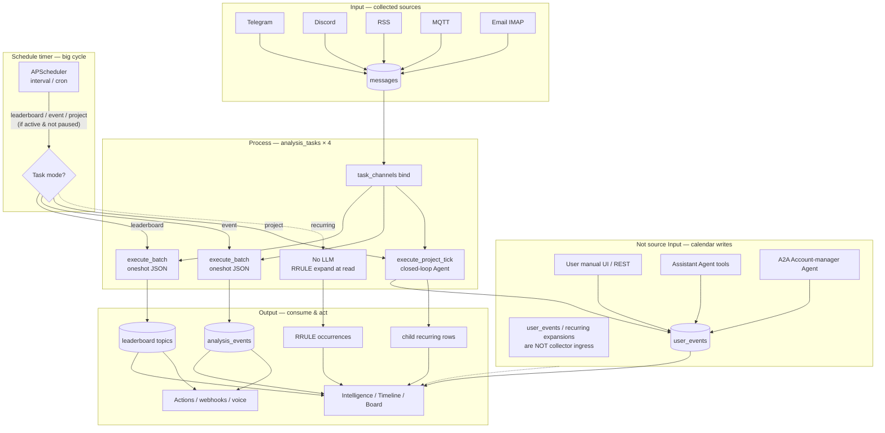
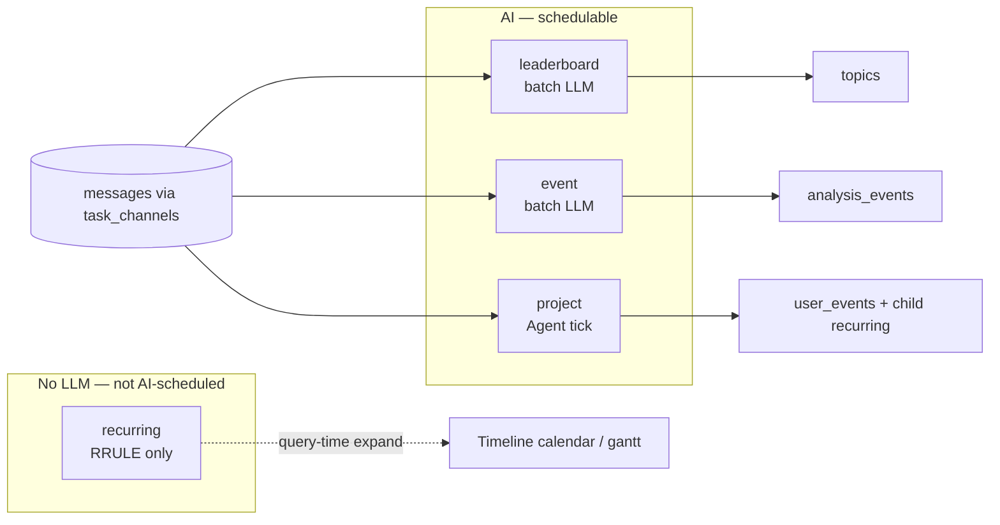
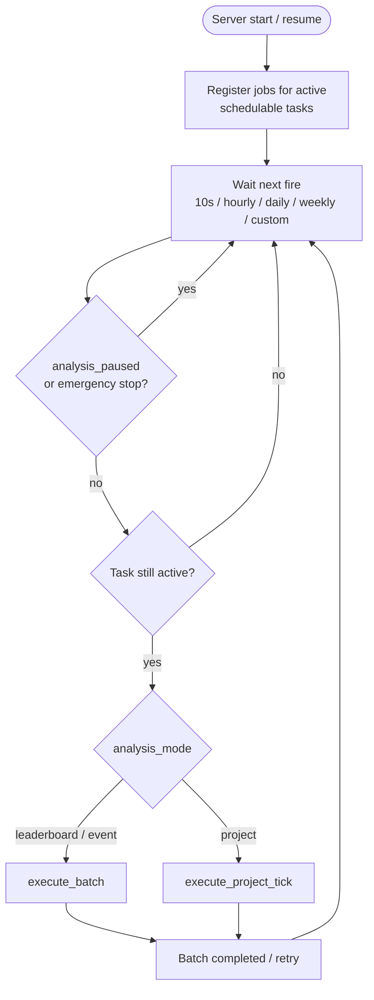
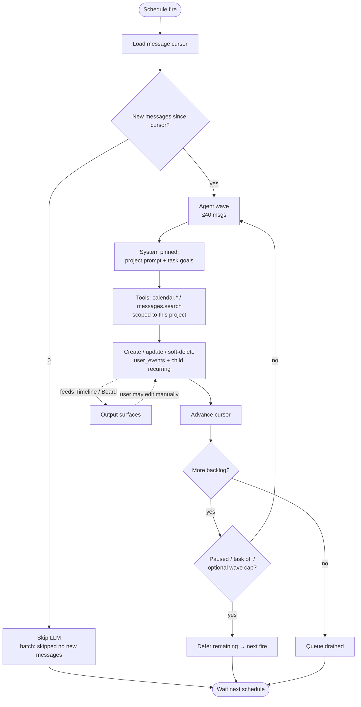

# System structure diagrams

High-level Mermaid views of Intelligence Monitor: **Input → Process → Output**, the five task modes, the schedule timer, and the project-manager feedback loop.

Contract detail stays in [`ARCHITECTURE.md`](../ARCHITECTURE.md) and [`agent/project.md`](../agent/project.md).

## 1. Big picture (Input → Process → Output + calendar side-channel)

## 2. Four task modes (who schedules, who reads messages)

| Mode | Scheduler | Reads `messages`? | Typical output |
|------|-----------|-------------------|----------------|
| `leaderboard` | Yes (`execute_batch`) | Yes | Leaderboard topics |
| `event` | Yes (`execute_batch`) | Yes | `analysis_events` |
| `project` | Yes (`execute_project_tick`) | Yes (cursor + drain) | Owned `user_events` + child `recurring` |
| `recurring` | No | No | RRULE occurrences at read |

## 3. Schedule timer (the big scanner loop)

Global pause / emergency stop and per-task disable stop **new** work; project drain also re-checks before **each wave**.

## 4. Project manager feedback loop (closed-loop)

Only `analysis_mode=project`. Other AI modes stay open-loop (batch → results, no tool writes back into the calendar).

Within one fire: waves share one continuing session (compacted history; system + goals stay pinned). The next schedule fire starts a **new** session if there is new backlog.

## Related

- [`ARCHITECTURE.md` Core design](../ARCHITECTURE.md#core-design-task-as-universal-interface)
- [`agent/project.md`](../agent/project.md)
- Root overview: [`../../README.md`](../../README.md)
