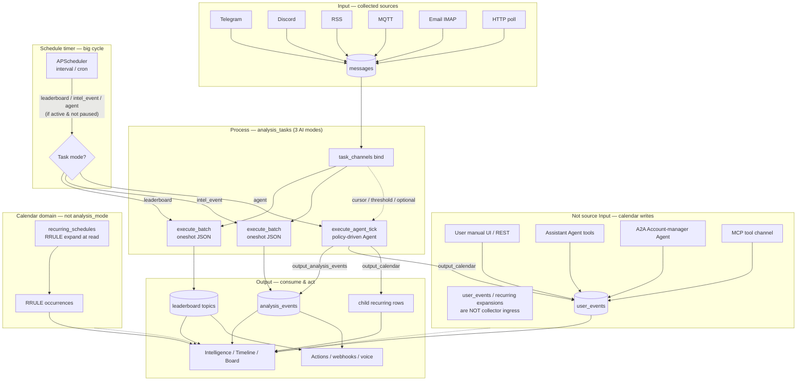
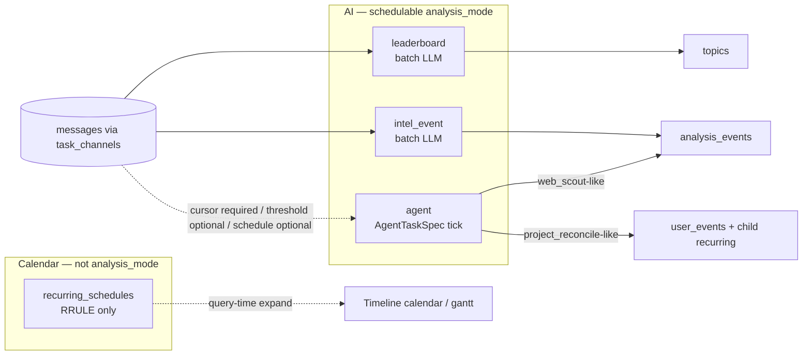
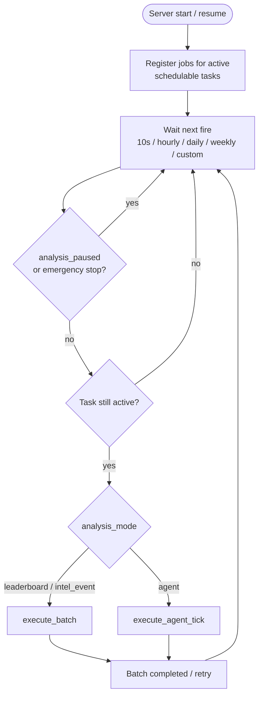
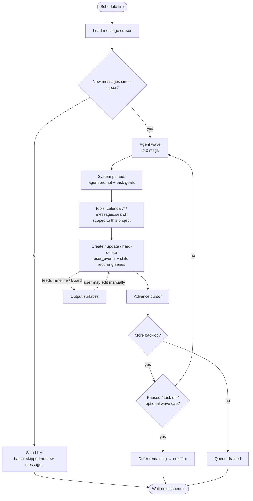

# System structure diagrams

High-level Mermaid views of Intelligence Monitor: **Input → Process → Output**, the **three AI analysis modes** (`leaderboard` / `intel_event` / `agent`), the schedule timer, and the project-reconcile feedback loop.

**`recurring` is not an `analysis_mode`.** Standalone RRULE series live on `recurring_schedules` and expand at query time only — they never enter the AI scheduler dispatch path.

Contract detail stays in [`ARCHITECTURE.md`](../ARCHITECTURE.md) and [`agent/agent.md`](../agent/agent.md)（產品預設「專案調和」；URL 僅 `/tasks/:taskId/agent`）.

## 1. Big picture (Input → Process → Output + calendar side-channel)

## 2. Three AI modes (who schedules, who reads messages)

AI modes are the only `analysis_tasks.analysis_mode` values. Calendar recurrence is a separate domain.

| Mode / domain | Scheduler | Reads `messages`? | Typical output |
|---------------|-----------|-------------------|----------------|
| `leaderboard` (`analysis_mode`) | Yes (`execute_batch`) | Yes | Leaderboard topics |
| `intel_event` (`analysis_mode`) | Yes (`execute_batch`) | Yes | `analysis_events` |
| `agent` (`analysis_mode`) | Yes (`execute_agent_tick`) | Depends on `trigger_mode` (cursor / threshold / schedule) | `user_events` and/or `analysis_events` per `AgentTaskSpec` |
| Standalone `recurring` series | **No** (not an analysis mode) | No | RRULE occurrences at read |

## 3. Schedule timer (the big scanner loop)

Global pause / emergency stop and per-task disable stop **new** work; agent cursor drain also re-checks before **each wave**. Recurring series never register here.

## 4. Project reconcile feedback loop (closed-loop)

Only `analysis_mode=agent` with calendar output (`output_calendar` / project_reconcile preset). Other AI modes stay open-loop (batch／agent findings → results, no tool writes back into the calendar).

Within one fire: waves share one continuing session (compacted history; system + goals stay pinned). The next schedule fire starts a **new** session if there is new backlog.

## Related

- [`ARCHITECTURE.md` Core design](../ARCHITECTURE.md#core-design-task-as-universal-interface)
- [`agent/agent.md`](../agent/agent.md)
- Root overview: [`../../README.md`](../../README.md)
